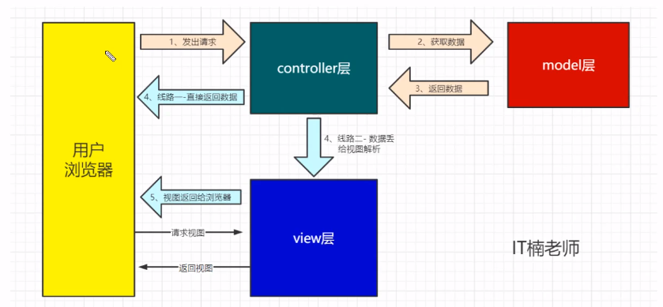
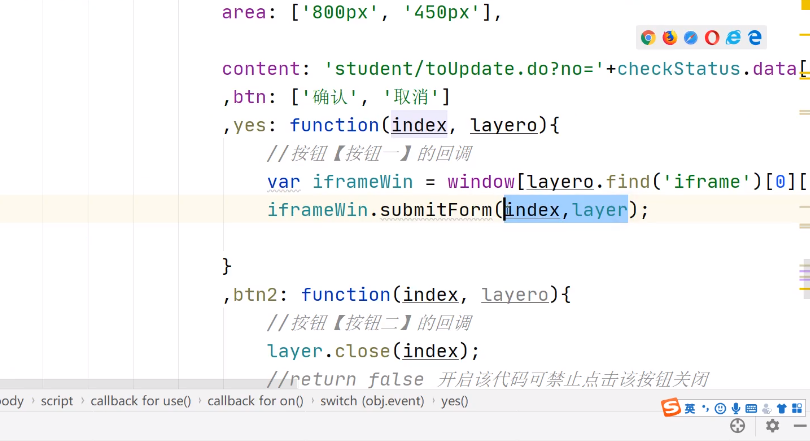
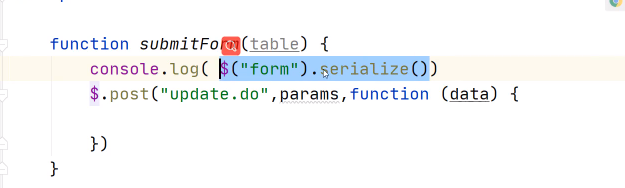

# JAVAWEB

## 第一章 Tomcat基础

+ Tomcat目录:

  bin:二进制可执行文件、conf:配置目录、lib：依赖库、log:日志文件、temp：临时文件、webapps：工程，html文件放这里、work：工作室，相关文件放里面。

## 第二章 Servlet入门

+ JavaWeb项目工程目录介绍:

  

+ 可以在配置文件中xml，传入参数，在Servlet中拿到参数，在do中用。

+ 还有一些匹配规则在实际开发中常用。

+ 欢迎页中直接填写资源地址。

  ```xml
  <init-param>
  	<param-name>type</param-name>
  	<param-value>product</param-value>
  </init-param>
  
  <servlet-mapping>
      <servlet-name>orderServlet</servlet-name>
      <url-pattern>*.do</url-pattern>
  </servlet-mapping>
  
  <welcome-file-list>
      <welcome-file>/welcome.html</welcome-file>
  </welcome-file-list>
  ```

+ ### **请求转发**

  请求转发表示由多个Servlet共同处理一个请求。

+ 所以entity对象都要实现序列化接口。因为程序可能在不同计算机运行需要序列化。不写一定存在问题。**序列化建议有空再看看**

+ request域

  httpServletRequest也就是我们常说的request，httpServletRequest.setAttribute意思就是在request范围内设置一个属性主要用来存值供其他页面操作，setAttribute("name",value)有两个参数第一个是由你定义的名称，第二个是要存入的值,在相邻页面你可以用 httpServletRequest.getAttribute("name")获取到value

+ 响应头是服务器告诉浏览器应该做的动作。响应头和响应码都可以设置。

+ 请求转发的过程，只有最后一个servlet才去拿到response的流进行响应，其他servlet可以对response进行操作如addHeader等。

+ 请求转发与重定向的区别：

  1. 请求转发不能发送到服务器资源外的网页，而重定向可以。
  2. 请求转发是服务端的动作，而重定向是浏览器的动作。
  3. 请求转发的url是不变的，重定向会变。
  4. 重定向是两次请求，请求转发是一次请求。


+ ### **session与cookie**

+ session存在与服务器，cookie存在于浏览器。

+ cookie与session是有对应关系的。


+ ### **静态资源的处理**

  Tomcat访问所有的资源，都是用Servlet来实现的。在Tomcat看来，资源分3种：1、静态资源，如css,html,js,jpg,png等。2、Servlet。3、JSP。

  对于静态资源，Tomcat最后会交由一个叫做DefaultServlet的类来处理。对于Servlet ，Tomcat最后会交由一个叫做 InvokerServlet的类来处理。对于JSP，Tomcat最后会交由一个叫做JspServlet的类来处理。[Tomcat学艺-Tomcat中对静态资源的访问也会用servlet来处理吗？_诸君拔剑吧.-CSDN博客](https://blog.csdn.net/zaimeiyeshicengjing/article/details/105858015)

### Cookie And Session

+ [服务器端Session和客户端Session（和Cookie区别）_曾梦想仗剑走天涯的博客-CSDN博客_session是在服务器还是在客户端](https://blog.csdn.net/java_faep/article/details/78082802)

## 第三章 jsp入门学习

+ 本质就是servlet

+ JSP的执行顺序

  1. 第一次访问，尝试加载，没有的话就编译jsp->servlet（work目录）就是把jsp编译（转换）成java文件。
  2. 加载
  3. 以后访问就直接访问内存里的servlet。

+ html注释会被write，jsp注释仅jsp文件可见。

+ <%! java代码 %>这在方式会把这个java代码编译到service外面。

+ 标签\<jsp:param>可以在请求转发\<jsp:forward>中传递参数。在servlet中参数可以通过getPramater(key:"name")获取。

+ 作用域(用不同的域对象进行数据传输。)

  1. pageContext可以理解为每一个servlet的作用域。**只在本页中的数据**
  2. request的域在这次请求的服务中，请求传递也可访问，但请求结束后不能再访问上一次的请求。**请求转发间共享数据**
  3. session是第一次访问该地址后创建的，服务器该应用下都可访问。**不同请求共享数据**
  4. application是最大的作用域，是整个服务器的属性设置。**整个应用的数据可共享**

  这个图有点问题，application是应用级别的。

  ```java
  //以下均是java代码，写在jsp中都要带上<%>
  pageContext.setAttribute();
  pageContext.getAttribute();
  request.setAttribute();
  request.getAttribute();
  session.setAttribute();
  session.getAttribute();
  application.setAttribute();
  application.getAttribute();
  ```

+ WEB-INF内的资源浏览器不能直接访问，可以通过转发进入。

+ 静态文件一般就放web下

## 第四章 EL表达式和JSTL标签库

+ 为什么要用这两个标签，为了在JSP代码中用标签代替java代码。
+ EL作用域是scope，pageContext对应的是pageScope。
+ EL表达式操作数字方便一些，操作字符串可能出现问题。
+ 循环遍历默认保存在pageContext中。

## 路径问题

/\*属于路径匹配，并且可以匹配所有request，由于路径匹配的优先级仅次于精确匹配，所以"/\*"会覆盖所有的扩展名匹配，很多404错误均由此引起，所以这是一种特别恶劣的匹配模式。

无论项目还是站点，根目录用/代替。不带根目录的就是相对路径。**使用相对路径一定要小心**,注：客户端即浏览器的根目录认定的是http://localhost:9999。

**以后少用相对路径，尽量使用绝对路径**

+ 站点根目录:http://localhost:9999

+ 浏览器根目录:就是站点根目录

+ 项目根目录http://localhost:9999/study

+ 对于工程，服务器，根目录是项目根目录

  ```java
  //相对路径：
  //若是从\http://localhost:9999/study/transmit.do请求转发
  //则转发的路径是http://localhost:9999/study/index.jsp
  //若http://localhost:9999/study/test/transmit.do就有可能出问题。
  req.getRequestDispatcher("index.jsp").forward(req,resp);
  //绝对路径:
  // /指代根目录。而工程里面/是http://localhost:9999/study
  req.getRequestDispatcher("/index.jsp").forward(req,resp);
  ```

  ```java
  http://localhost:9999/user.do
  http://localhost:9999/study/index.jsp
  resp.sendRedirect("index.jsp");
  
  http://localhost:9999/user.do
  http://localhost:9999/index.jsp
  resp.sendRedirect("/index.jsp");
  ```

  ```java
  //重定向写法
  resp.sendRedirect(req.getContextPath()+"/index.jsp");
  ```

  ```html
  //css渲染的路径也区分相对和绝对，相对路径相对的是本jsp的路径
  <link rel="stylesheet" href="static/index.css">
  //获取绝对路径
  <%
            String path = request.getContextPath();
            String basePath = request.getScheme()+"://"+request.getServerName()+":"
                              +request.getServerPort() + path + "/";
        %>
  ```

  ```html
  <!-- 有了下面这句话所以的href,以及action都会以此作为基地址。 -->
  <base href="<%=basePath%>">
  ```

  + 提交表单的绝对路径的根目录是站点根目录。

+ 以后jsp中的代码要有

  ```html
  <%
            String path = request.getContextPath();
            String basePath = request.getScheme()+"://"+request.getServerName()+":"
                              +request.getServerPort() + path + "/";
        %>
  <base href="<%=basePath%>">
  加了以上的代码，路径加/代表绝对而不加代表相对，相对的是basePath。
  ```

## 重要的content-type

get是在url上直接传递参数，post是将参数封装到请求中。通过getParameter获得参数。get是“没有请求体”，数据在url上，但是也可以通过getparameter拿的数据。

以下数据格式都是跟表单有关，在表单的enctype属性进行设置。

+ capplication/x-www-form-urlencoded: <form encType="">中默认的encType,form表单数据被编码为key/value格式发送到服务器(表单默认的提交数据格式)
+ application/json：json数据格式
+ multipart/from-data:需要在表单中进行文件上传时，就需要使用该格式。

## 字符问题

1. 浏览器默认到request的字符处理是ISO。
2. service到数据库也需要规范编码。

+ 所以重点有两个地方需要规范编码问题。

## 第五章 Listener、Filter

+ 一个请求匹配了多个Filter则都会进行处理。一个请求匹配了多个Servlet则只会找一个最准确的。结论：一个请求可以通过匹配经过多个filter，但一个请求只能通过请求转发经过多个servlet。
+ 过滤放行靠filterChain.doFilter。然后过滤的前后请求就在放行的前后即可。
+ 在filterChain.doFilter之后resp.addHeader是没有作用的。
+ 
+ Listener可以监听请求的创建销毁，会话的创建与销毁。

## 第六章 MVC架构




就是代码写的规范。

Servlet处理请求返回响应，但是具体操作又再交给service(业务层)。

表单校验问题，对于表单检验前端做了过后后端也应该进行，因为前端不安全。

在js中的json代码块的语法要求松散一些。但在文件传输过程中json文件的key与字符串都得带上双引号。

**fastJson.jar**包可以用来JSON转对象，对象转JSON字符串。对象不需要强制转换toString方法。

## 文件映射

+ 文件上传，Tomcat文件映射默认配置在/conf文件夹的server.xml文件中修改\<Host appBase="webapps"\>，appBase可以指定绝对目录，也可以指定相对于<CATALINA_HOME>的相对目录，如果没有默认此项，默认为<CATALINA_HOME>/webapps。默认根目录webapps,相对于CATALINA_HOME

+ 同在/conf文件的server.xml文件中添加\<Context>标签可以解决问题。

  ```html
  <Context path="/shop/image" docBase="G:\\upload" debug="0" reloadbale="true"/>
  ```


### 配置多数据源

+ 实际项目不可能仅使用一个数据源，一般会使用多个，有时还需要访问远端数据源。一个数据源可以简单理解为一个database。

+ 具体配置需要完成的是：1.新建一个properties。2.在BaseDao中新建一个静态DataSource。3.静态代码块中配置数据源。4.getRemoteConnection复写。

+ 具体步骤:

  1. RemoteBaseDao继承BaseDao重写Connection方法。

  2. 新建学生类，新建StudentDao接口，实现StudentDaoImpl，要求继承RemoteBaseDao实现StudentDao接口。

  3. 写sql语句，查询结果。jsp显示查询结果

  4. WEB-INF中新建pages用于存放显示jsp文件。因为这样外部是无法直接访问的，只有内部请求转发访问。

  5. StudentServlet、StudentService并且在其中写listStudents方法、StudentServiceImpl实现接口方法。

  6. 查询结果放在请求域中。传到jsp中。放application和session都不好。最合适是通过请求域带走数据。student.jsp

  7. 写jsp，用el表达式和jstl。

     

+ **网页过来的parameter都是字符串。其实是个map<String,String>**

### 表的增删改

+ 先写DeleteStudentServlet,重写其doGet方法。要求实现根据id删除，再重定向到表页。

+ studentService.deletStudent(studentNumber)、StudentServiceImpl实现方法。StudentDao写deletStudent,sql语句 delet  from student where student_nums = ?

+ student.jsp 每一行加修改和删除标签，超链接标签href

  

+ servlet中拿到参数并重定向

  

### 修改-回显

流程是先点击删除，跳转到toupdataservlet，再请求转发到update.jsp页面，页面在通过表单提交到updataservlet。

+ WEB-INF/pages 添加update.jsp

  

+ controller中分包,新建ToUpdateStudentServlet-@Webservlet("/student/toUpdata.do") 

  

+ Dao层中添加一个getStudentByNumber(Long no)

  

+ 把查询到的结果用EL表达式写在updata.jsp中

  

+ 用input中type=hidden隐层学号避免被修改

### 将修改数据

+ update.jsp中表单用post形式提交到"student/Update.do"
+ 写Update.do的映射的servlet。


### 分页

#### 封装分页对象

+ 前端规定参数：currentPage、pagesize。后端查询数据：totalPage

+ limit参数说明:第一个是起始条数，第二个是显示条目数，条目索引是从0开始的。起始条目数计算：(currentPage - 1)*pagesize

+ 注：EL表达式中**对象.属性名**默认调用的是get方法，EL对域中的map对象也可以直接.

+ 上页下一页，通过超链接传参修改currentPage。加一减一。跳也就是通过跳转带上currentPage参数。跳转带上pagesize参数可以修改每页显示条目数。

+ 难点就是封装对象和分页公式。

+ 原生js，input的指是属性value。在jqury中是val()方法。

  

  

### 查询

+ 关键：当前url拼接所需传递参数。js中location.href即为浏览器上的地址。
+ Dao层拿出前端过来的查询参数将其拼接到sql语句中。
+ sql limit语句限制的是查询结果而非整体数据。
+ bug:前端传参参数同名，后端getParameter的时候只拿得到第一个参数。
+ 前端EL表达式拿域中数据，非字符串数据会自动转为字符串。其实是后台**setAttribute的时候，存到域里面的数据是默认调用了toString方法。**
+ 姓名是模糊查询，sql语句用过like。
+ 查询回显。

### 异步查询数据渲染表格

+ **后台往前台传输数据：**

  1. response写JSON数据，前台jquery进行读取。
  2. 后台将数据打包成对象或map封装到域里面，一般装在request或session域中。

+ 应用ajax加jquery，实际操作就是按钮点击后ajax发送请求到后台，后台将数据用json格式回传，前台再解析数据动态更新表格数据。

  

+ **ajax是异步的**

  

  这个请求一旦发出去后，程序会直接往下执行，可以理解为这个是另开了个线程。这个线程去请求数据，而主线程接着执行代码。注：**所以要用到data必须要把需要执行的函数写在回调函数里面。**

### 数据表格

+ 应用框架，基本都是用JSON配置前端框架格式内容

+ 多行删除时不要单独封装多个请求，而是一次性将所有对象一次封装一次请求。

+ js数组map函数，说白了就是遍历元素进行映射，返回新数组

  

+ post可以直接将数组传到后台，到后台数组变成字符串。

+ 数组到后台其实是&no=1&no=2&no=3,重名的参数要用getParameterValues去取,而且后台拿的key是no[]

+ 

+ 修改数据

  这里要搞清楚iframe的父子关系:

  

  要想用确定按钮操作，必须是先获得其子类iframe的内容。

  1. 用弹出进行修改

     

  2. 再加按钮

     

  3. 获得子元素内容

     

     这里两个参数:index，layero，具体不太理解，但应该都是用来获得子iframe的。

     参数解释：layer是开启的一个弹窗，index这个参数记录了当前弹窗的索引。**每一次弹窗，index++**，然后layer是一个大类或者你把它当方法用，也是当参数用的，用这个layer.close（index）进行关闭弹窗。layero应该是子弹窗的layer。

  4. jQuery可以将form表单序列化为一个对象，再将这个对象传至后端用ajax进行修改。

     

     

     

  5. 现在再这个submitFrom进行页面关闭和刷新页面。

     

     

