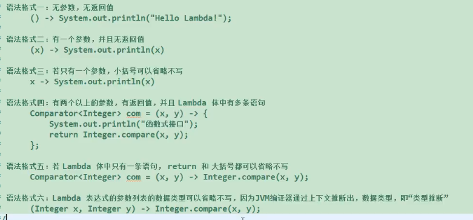

# 平时编程的小疑问

## Java

+ 当对对象引用而不是基本类型运用final时，其含义会有一点令人迷惑。对于基本类型，final使数值恒定不变；而用于对象引用，final使引用恒定不变。一旦引用被初始化指向一个对象，就无法再把它改为指向另一个对象。然而，对象其自身却是可以被修改的，Java并未提供使任何对象恒定不变的途径

+ 双括号初始化map

  ```java
  Map<String, String> map = new HashMap<String, String>() {{    
      put("name", "吴仙杰");    
      put("englishName", "Jason Wu");
  }};
  ```

  1. 第一个括号是匿名内部类的括号
  2. 第二个括号是初始化块的括号

  - 执行顺序：静态初始化块 → 实例初始化块 → 构造函数
  - 执行阶段：静态初始化块在类初始化阶段执行。实例初始化块和构造函数在对象实例化阶段执行
  - 执行次数：不论实例化多少个对象，静态初始化块都只执行一次。实例化几个对象，就执行几次实例初始化块和构造函数
  
+ 第一次主动使用一个类会被classloader加载到内存中。

+ FileOutputStream读取流的时候如果是文件夹，就会出错，无论怎么读，都拒绝访问，应该在读取的目录后面加上文件名！

+ 所有从前端发送的parameter，无论是post还是get，数据到后端后，getParameter拿到的数据都是String。

+ maven找不到依赖东西：file->invalidate cache。setting->maven->runner->delegate IDE...

+ maven工程，编译后classPath在classes里面，所以classloader找文件也是在classes里面找，类加载器在类路径中查找，所以用相对路径，所以配置文件url可以不带第一个斜线

+ 匿名内部类在调用同级外部变量时，该变量需要是final修饰。jdk8之后不用写final，但本质还是final变量。

+ lambda表达式基本语法

  1. 
  2. lambda表达式需要函数式接口。函数式接口：即接口内只能有一个方法。可以用注解@FunctionalInterface标注。
  3. 常用于Comparable、Runable等接口。

## Spring

+ 当前端传数据过来不想每次都新建一个实体类时，可以用map，但是map就缺失了参数校验的功能，需要手动在service里面进行校验。

## 输入输出

+ 输入：`Scanner sc = new Scanner(System.in);`

  next()能跨行。但是不跨空格，即如果next后再nextLine会带上这一行的空格。

  | 描述             | 语句                                                         |
  | ---------------- | ------------------------------------------------------------ |
  | 读入一个整数     | `int n = sc.nextInt();`                                      |
  | 读入一个字符串   | `String s = sc.next();`                                      |
  | 读一个浮点数     | `double t = sc.nextDouble();`                                |
  | 读一整行         | `String s = sc.nextLine();`                                  |
  | 判断是否有下一个 | `sc.hasNext()或sc.hasNextInt()或sc.hasNextDouble()或sc.hasNextLine()` |

  ```java
  package dsfa;
  
  public class A
  {
      public static void main(String args[])
      {
          double d = 345.678;
          String s = "你好！";
          int i = 1234;
          // "%"表示进行格式化输出，"%"之后的内容为格式的定义。
          System.out.printf("%f", d);// "f"表示格式化输出浮点数。
          System.out.println();
          System.out.printf("%9.2f", d);// "9.2"中的9表示输出的长度，2表示小数点后的位数。
          System.out.println();
          System.out.printf("%+9.2f", d);// "+"表示输出的数带正负号。
          System.out.println();
          System.out.printf("%-9.4f", d);// "-"表示输出的数左对齐（默认为右对齐）。
          System.out.println();
          System.out.printf("%+-9.3f", d);// "+-"表示输出的数带正负号且左对齐。
          System.out.println();
          System.out.printf("%d", i);// "d"表示输出十进制整数。
          System.out.println();
          System.out.printf("%o", i);// "o"表示输出八进制整数。
          System.out.println();
          System.out.printf("%x", i);// "d"表示输出十六进制整数。
          System.out.println();
          System.out.printf("%#x", i);// "d"表示输出带有十六进制标志的整数。
          System.out.println();
          System.out.printf("%s", s);// "d"表示输出字符串。
          System.out.println();
          System.out.printf("输出一个浮点数：%f，一个整数：%d，一个字符串：%s", d, i, s);
          // 可以输出多个变量，注意顺序。
          System.out.println();
          System.out.printf("字符串：%2$s，%1$d的十六进制数：%1$#x", i, s);
      double x = 2.0 / 3;
      //保留两位小数,用printf与println的不同操作方法
      System.out.println("x is " + (int)(x * 100) / 100.0);
      System.out.printf("%.2f", x);
  ```

  

+ | 转 换 符 | 说  明                                      | 示  例       |
  | -------- | ------------------------------------------- | ------------ |
  | %s       | 字符串类型                                  | "mingrisoft" |
  | %c       | 字符类型                                    | 'm'          |
  | %b       | 布尔类型                                    | true         |
  | %d       | 整数类型（十进制）                          | 99           |
  | %x       | 整数类型（十六进制）                        | FF           |
  | %o       | 整数类型（八进制）                          | 77           |
  | %f       | 浮点类型                                    | 99.99        |
  | %a       | 十六进制浮点类型                            | FF.35AE      |
  | %e       | 指数类型                                    | 9.38e+5      |
  | %g       | 通用浮点类型（f和e类型中较短的）            |              |
  | %h       | 散列码                                      |              |
  | %%       | 百分比类型                                  | ％           |
  | %n       | 换行符                                      |              |
  | %tx      | 日期与时间类型（x代表不同的日期与时间转换符 |              |

  ```java
  public static void main(String[] args) {
          String str=null;
          str=String.format("Hi,%s", "王力");
          System.out.println(str);
          str=String.format("Hi,%s:%s.%s", "王南","王力","王张");          
          System.out.println(str);                         
          System.out.printf("字母a的大写是：%c %n", 'A');
          System.out.printf("3>7的结果是：%b %n", 3>7);
          System.out.printf("100的一半是：%d %n", 100/2);
          System.out.printf("100的16进制数是：%x %n", 100);
          System.out.printf("100的8进制数是：%o %n", 100);
          System.out.printf("50元的书打8.5折扣是：%f 元%n", 50*0.85);
          System.out.printf("上面价格的16进制数是：%a %n", 50*0.85);
          System.out.printf("上面价格的指数表示：%e %n", 50*0.85);
          System.out.printf("上面价格的指数和浮点数结果的长度较短的是：%g %n", 50*0.85);
          System.out.printf("上面的折扣是%d%% %n", 85);
          System.out.printf("字母A的散列码是：%h %n", 'A');
      }
  ```

