# Java视频笔记

## 第7章 方法

+ main是由JVM调用的。
+ 方法名在标识符命名规范当中，要求首字母小写，后面每个单词首字母大写。

* jvm内存结构：方法区（由classloader将xxx.class字节文件装到jvm当中，也就是方法中存储代码片段）、堆区、栈区

## 第8章 面向对象

* 属性在代码上是以变量形式存在（描述状态），因为属性对应数据
* java中除了基本数据类型之外，剩下的数据类型都是引用。**基本数据类型变量存的是数据本身，而引用类型变量存的是保存数据的空间地址**
* 带static的方法用类名调，不带的用new实例去调用方法。
* 不论什么方法，实例、构造、静态方法等都会压栈。堆存实例变量，栈存局部变量。
* 栈：方法只要执行，就会压栈。堆：new出来的对象都在堆中。垃圾回收器主要控制该区变量。方法区：类的信息，字节码、代码片段、静态变量。
  方法的代码片段放在方法区，但是方法执行过程当中需要内存在栈中。
* static静态变量，在类加载时初始化，不需要new对象，静态变量的空间就开出来了。**栈：局部变量、堆：实例变量（对象级别）、方法区：静态变量（类级别）。** 静态的属性、方法实际都是类名在调用。
* 默认封装应该是public
* 工具类一般的方法都是静态的。
* 静态代码块在类加载时执行，并且只执行一次，自上而下，而且在main方法之前执行。一般静态代码块可以在类加载时记录日志。
* 实例块在构造方法之前执行。
* this是指向自身实例的指针
* **由于main是静态方法，所以main中是无法直接访问类下的实例方法以及实例变量**，this不能出现在static方法中！！！,**因为静态方法不会默认传参this**
* java方法中没有缺省参数设在默认值的方法。
* this(形参列表),在构造方法中可以直接调用构造方法。一般用于代码复用。注：this()的调用只能出现在构造方法的第一行,表示当前构造方法调用本类其他构造方法。

## 第9章 继承

+ 封装

  - **private 　在当前类中可访问**
  - **default    在当前包内和访问**
  - **protected  在当前类和它派生的类中可访问**
  - **public     公众的访问权限，谁都能访问**

+ c++继承与java继承区别：**在c++中，重载不会发生在基类与派生类之间，派生类中的同名函数都会将基类中的同名函数隐藏（将在下边说明隐藏）掉，而不会是重载关系。当你通过派生类对象调用该同名函数时，只能访问派生类的该函数，如果硬要访问基类的该函数，则需要在函数名前加上类作用域，在java中子类会将父类中的方法继承过来，子类中同名方法会和父类中的同名方法要么是重载关系，要么是覆盖关系，要么就错误（比如同名同参却是不同的返回类型！）**

+ 对于虚函数(用virtual修饰的)，如果基类中有一个虚函数，派生类中同样有一个同名同参的函数（那么该函数将自动虚化）， 那么其返回值一定要和基类的虚函数的返回值相同！否则隐藏失败！

  但是在java中请记住这样的原则：非静态方法只能由（或被）非静态方法覆盖！静态方法只能由（或被）非静态方法覆盖！抽象方法必须在具体类中被覆盖！最终方法(带关  键字final的方法)不能被覆盖！

+ java不支持多继承，c++可实现多继承。虽然不能多继承，单可以间接继承。

+ 继承除构造方法无法继承之外，剩下都可以继承，但是私有的属性无法在子类中直接访问。父类中private修饰不能在子类中直接访问。可以通过间接的手段来访问。

+ java默认继承上帝类Object

+ 关键字extend

+ 继承父类修改子类也需要修改，所以继承会增强代码之间的耦合度。

+ **当源码当中一个方法以";"结尾，并且修饰符列表中有"native"关键字，表示底层调用C++写的dll程序(dll动态链接库)。

+ Object类

  方法：

  + equal(Object obj)
  + clone()
  + toString()，返回：ClassName@addr(哈希运算后的地址)，注println(引用)会自动调用toString方法

## 第10章 方法覆盖与多态

+ 方法覆盖即将继承对象的方法进行重写，并将继承的方法覆盖掉。当子类进行了方法覆盖后，不会调用继承方法，而一定会调用覆盖后的方法。

+ **方法重写的条件**：1、继承关系2、返回、方法名、参列所有一致（好像返回值在继承时可以不同，**有待解释**）。（而如果形参列表不同不是重写而是重载）3、访问权限不能更低，可以更高。（**有待解释**）4、重写方法不能比之前的方法抛出更多的异常。（**有待解释**）

  注意：1、方法覆盖与属性无关，只与方法有关。2、私有方法无法覆盖。3、构造方法不能被继承，所以构造方法也不能被覆盖。4、覆盖指针对实例方法，对静态方法覆盖无意义。

  **大多类的toString()都需要重载**

+ **点前只能是引用、类名**

+ 向上转型与向下转型
  向上(upcasting)：子—>父（自动类型转换）：Animal a = new Cat();
  向下(downcasting)：父—>子（强制类型转换，需要加强制类型转换符）Cat c = (Cat)a;
  注：无论是向上还是向下，两种类型必须有继承关系，没有继承关系报错。

+ 父类引用允许指向子类对象(向上转型)

+ 多态
  程序编译阶段、运行阶段：
  对于编译器，编译器只知道a2的类型是Animal，所以编译器在检查语法的时候，会去Animal.class字节码中寻找move方法，找到了绑定上move()方法，编译通过，静态绑定成功。(编译阶段属于静态绑定)
  运行阶段：实际上在堆内存中创建的java对象是cat对象，所以move的时候，真正参与move的对象是一只猫，所以运行阶段会动态执行cat对象的move方法，这个过程属于运行阶段绑定。(运行阶段绑定属于动态绑定)
  **多态：父类引用指向子类对象，包括编译阶段绑定父类方法，运行阶段动态绑定子类对象方法。  多种形态。**

+ 什么时候必须向下转型？
  当需要访问子类对象特有方法必须向下转型。 

+ 向下转型的风险、
  即父类指向了一子类，但通过向下转型转为另一子类。此时编译器不报错，而运行阶段抛出异常：java.lang.ClassCastException:**重要异常还有java.lang.NullPointerException**。

+ 如何避免ClassCastException异常的发生
  **instanceof运行阶段动态判断**
  第一：instanceof可以在运行阶段动态判断引用指向的对象类型
  第二：instance的语法：（引用 instanceof 类型）
  第三：instanceof运算符的运算结果只能是true/false
  第四：c是一个引用，c变量保存了内存地址指向堆中对象。则（c instanceof Cat）为true表示：c引用指向堆中对象是一个Cat
  所以**当类型向下转型时要用instanceof**

+ 多态在开发中的作用

  降低程序耦合度，提高扩展力。方便扩展，在面向父类情况下编程更加易于扩展。

+ 私有方法无法覆盖，方法覆盖只针对实例方法，静态方法覆盖无意义。因为静态方法虽然可以引用.但实际与引用无关，只与类相关。**多态与对象有关，静态方法不需要对象**

+ 同一文件中，不能有多于一个public声明的类出现，可以将其中一个public去掉，即不加任何修饰符，通常称为“默认访问模式”，在该模式下，这个类只能被同一个包中的类访问或引用，这一访问特性又称包访问性。

+ 由于private方法被自动认为是final方法，而且对子类即Derived是屏蔽的，根本不能被重载和重写，所以此时Derived类里面的"public void f()"方法属于一个全新的方法，对基类的引用po来说也不可见，调用的只能是"private void f()"。

  结论：只有非private方法才能被真正的覆盖，虽然上面的例子编译器不报错，但是结果并不是我们期望的。对于子类来说，最好不要采用和基类private方法相同的名字做方法名。

  （**以上有待补充**）

+ 子类对象确实拥有父类对象中所有的属性和方法，但是父类对象中的私有属性和方法，子类是无法访问到的，只是拥有，但不能使用。就像有些东西你可能拥有，但是你并不能使用。所以子类对象是绝对大于父类对象的，所谓的子类对象只能继承父类非私有的属性及方法的说法是错误的。可以继承，只是无法访问到而已。

+ 总结：私有不能覆盖，静态不谈覆盖

+ 对于相同的返回类型这一点（重写）

  返回类型是基本数据来说，必须一致

  返回类型是引用类型来说，重写之后返回值类型可以更小（即返回子类是可以的）**意义不大，一般不这么做**

## 第11章 super

super(实参)：初始化当前对象的父类的特在。

super关键字代表就是当前对象那部分父类特征。虽然是继承，但完成继承后属性以属于该对象。

把super当作命名空间（自己猜想，不知道是否正确。）

+ super与this

  this:能出现在实例方法和构造方法中。语法是this.和this()，不出现在静态方法中，this()只能出现在构造方法第一行，通过当前构造方法去调用**本类**中其他的构造方法，目的是代码复用。

  super:能出现在实例方法和构造方法中。语法是super.和super()，不出现在静态方法中，this()只能出现在构造方法第一行，通过当前构造方法去调用**父类**的构造方法，目的是创建子类对象先初始化父类特征。

+ super()表示子类的构造方法调用父类的构造方法。

+ 当一个构造方法第一行：

  即没有this()、super()时默认有一个super();所以要保证父类无参构造存在。

+ 注：this()\super()不能同时存在，他们只能在构造函数的第一行。

+ java中不管new什么对象，最后Object的无参构造方法一定执行。（object构造在栈顶）

+ 构造方法执行过程中一连串调用了父类的构造方法，父类的构造方法继续调用父类构造方法。但实际只创建了一个对象。

+ super什么时候不能省略，在需要区分子父类同名属性或方法时，若不加super，同名属性或方法默认调用子类的。还有在子类想要调用父类特征时需要用super.

+ super不指向任何对象，仅仅代表当前对象的那一块父类特征。

+ IDEA快捷键
  psvm、sout、
  ctrl+y ： 删除一行
  alt+左右：左侧列表展开,也可切窗口
  alt+insert:任何新增
  ctrl + shift + F12:窗口变大，变小
  alt+标号:切换窗口
  ctrl+p:可以查看函数穿的参数

## 第十二章 final关键字

**final修饰东西都不变**

* 可修饰变量、类、方法，表示最终的。

  当修饰类时，该类不可被继承。（**什么时候用有待补充**）

  当修饰方法时，该方法不可被覆盖（重写）。

  final不控制调用的问题，表示的是能不能再改变。

  当修饰局部变量时，一旦赋值后不能再更改。即final修饰的变量只能赋值一次。**对于引用也是同理**

  final修饰引用：该引用永远只能指向一个对象。但该对象的值可以修改

  当修饰实例变量（实例变量不赋值会默认赋初值），当被final修饰时，实例变量必须手动赋值。（手动赋值可以再构造函数中赋值）

  final修饰实例变量时，应该在final前加static将其存储再方法区，节省空间。**static final联合修饰变量即为常量**，常量是不能变的静态变量，在类加载时初始化。

## 第十三章 抽象类与接口

### 抽象类（和c++的virtual一样）

+ 当作virtual类理解即可无法实例化。抽象类也是引用数据类型。抽象类的子类还可以是抽象类。

+ 语法：[修饰符] abstract class 类名{类体}

+ final与abstract无法联合使用。

+ 抽象类有构造方法，供子类使用，抽象类new不出来。

+ 抽象方法，eg:public abstract void func();

  抽象方法没有方法体，专供子类重写的。  抽象方法必须在抽象类中。

+ 非抽象类继承抽象类，必须将抽象方法实现（重写）。 

+ (面试题) java语言中凡是没有方法体的方法不一定就是抽象方法。

  object类中有很多没有方法体的方法，且又不是抽象方法。

  ```java
  public native int hashCode();
  ```

  这个方法底层调用了C++写的动态链接库程序。前面修饰符列表中有一个native，表示调用JVM本地程序。

+ 抽象的类里可以有抽象的方法和非抽象的方法 抽象类中的非抽象方法往往是抽象类所有未来子类都具有的,且不会因为子类的不同而具体实现不同的方法

### 接口

**类在强制类型转换过程中，如果是类转换成接口类型，那么类和接口之间不需要存在继承关系也可转换。**

接口离不开多态，编程要面向抽象编程。接口可以解耦合，解开接口的调用者与实现者之间的耦合。

+ 接口是引用数据类型，编译后还是class，接口完全抽象（抽象类半抽象），或者可以说是特殊的抽象类
+ 语法:[修饰符] interface 接口名{}
+ 接口支持多继承
+ 接口只包含两个部分，一部分：常量，一部分：抽象方法
+ 接口所有元素都是public修饰，接口类中所有方法均只能为抽象方法，且public abstract 可以省略。接口中的常量可以省略 public static final
+ is a、has a、like a
  is a：表示继承关系
  has a：表示“关联关系”，关联关系通常以属性的形式存在。
  like a：表示实现关系，实现关系通常是类实现接口。
+ 抽象类和接口的区别
  抽象类是半抽象的，接口是完全抽象的。抽象类中有构造方法，接口中没有构造方法。接口和接口之间支持多继承，类和类之间只有单继承。一个类可以同时实现多接口，一个抽象类只能继承一个类。接口中只允许出现常量和抽象方法。**一般接口使用的多一些，接口一般对行为进行抽象**

## 第十四章

### package和import

* 包机制的作用是方便程序管理，不同功能的类分别存放在不同包下。
* package是关键字，后面加报名。例如：package com.bjpower.javase.chapter17;
  **注：package语句只能出现在java源代码第一行**
* 对于带有package的java程序，类名会有变化，eg：com.bjpowernode.javase.chapter17.HelloWorld
  编译命令 javac -d . HelloWorld.java
  **类名会自动带上包名**
* 同一包下，包名可以省了。不同包下，利用import语句把需要类导入。imort只能在package下，class声明前。
* lang包下直接子类不需要导入，但子包需要导入。
* import java.util.*，不会导致效率低，因为编译器会自动把 *替换成类名

### 访问控制权限

public：本类、同包、子类、任意
protected：本类、同包、子类（不同包）
default：本类、同包
private：本类

* 属性（4个均可）、方法（4个均可）、类（public和默认）、接口（public和默认）

### Object类

* 目前需要知道的几个方法：
  protected Object clone()    /负责对象克隆
  int hashCode()            /获取对象哈希值
  boolean equals(Object obj)      /判断两个对象是否相等
  String toString()                       /将对象转换成字符串形式(**一般自己写的类建议重写**)
  protected void finalize()       /垃圾回收器负责调用
* equals方法
  设计目的：用来判断两个对象是否相等。根据实际需要可以判断是否需要重写。注：java没有符号重载，所以‘==’是不可判断对象是否相等，**例如‘==’无法判断string是否相等**。默认的equal是用‘==’判断对象是否相等。**注：重写的时候除修饰符可以不同（只能大，不能小），其余都得一样否则就是重载**
   null instanceof 都是false
  结论：基本数据用‘==’判断相等，引用数据用equal方法判断相等。

* finalize()方法**jdk9之后舍弃**
  protected修饰，在obj中只有一个方法体且没有代码的方法。该方法不用手动调用，JVM垃圾回收自动调用。如果想在对象被销毁时执行动作，可以在finalize中实现。
  system.gc()可以建议启动垃圾回收器。
* hashCode方法：
  该方法在Object类中有native关键字，底层调用c++。该方法返回的时哈希码，实际上是内存地址经过哈希算法返回的一个值（可以看作地址）。
* 深clone与浅clone。（**待补充**）

### 匿名内部类

* 内部类：在类的内部定义一个新类。
* 内部类分类：静态内部类：类似于静态变量、实例内部类：类似于实例变量、局部内部类：类似于局部变量。
* 使用内部类编写代码可读性差尽量不用。
* 匿名内部类是局部内部类的一种。（没有名字的内部类）
* **当接口作为形参，可以new 接口名(){实现方法}来穿参数**
* 可读性差，无名。

## 第十五章 数组

数组是引用数据类型，所以数组对象在堆内存当中。数组可以装基本数据，也可装引用，数组内存在堆中，即其容器中的数据也在堆中。

### 一维数组

* 数组是一个容器，数组装的是java对象时实际装的是对象的引用。java数组创建后，长度不可变。

* 所以数组对象均匀length属性，数组元素需要统一。数组元素内存地址连续。

* 数组声明方式与c++略区别：

  ```java
  int a[5];  //c++
  int[] a = new int[5];  //java
  int[] a = {1,2,3};   //静态
  int[] a = new int[5]; //动态
  //匿名数组传参
  printArray(new int[]{1,2,3,4});
  printArray(a);
  ```

* **声明数组长度时，不可以同时赋值**

* main函数的String[] args数组是存在的，非null，长度为0。命令行运行可以传参，idea中可以配置运行参数。

* 数组拷贝：

  ```java
  System.arraycopy(src,srcPos,dest,destPos,length);
  ```

  **对System.arraycopy()确实是浅拷贝，不会进行递归拷贝，所以产生的结果是基本数据类型是值拷贝，对象只是引用拷贝**

### 二维数组

* c语言二维数组和java二维数组的两大区别:

  1. 两者内存空间不同

     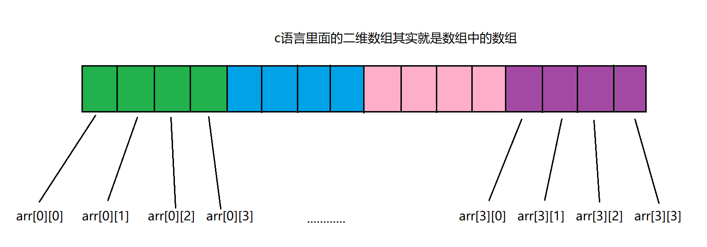

     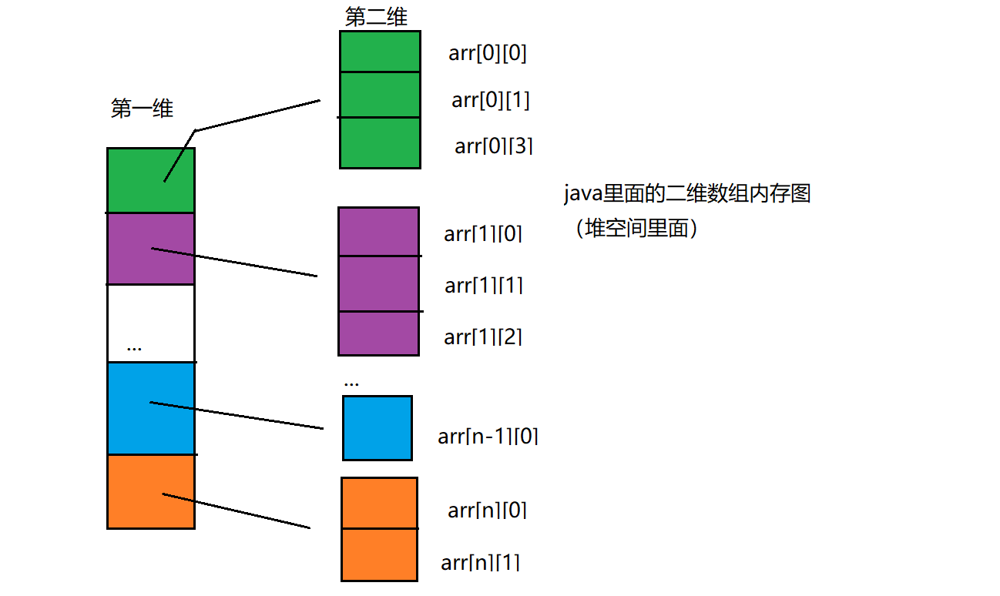

  

  2. 两者第二维不同

     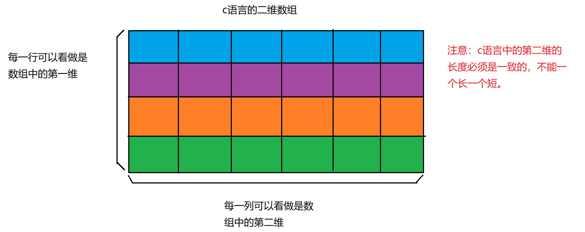

     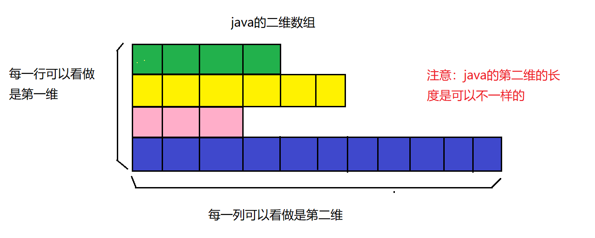

### Arrays类

一个工具类，其中有一个sort()方法，可以排序。静态方法，直接使用类名调用就行。常用方法Arrays.sort()、Arrays.binarySearch()

### 冒泡排序

关键：就是内外层循环，每次内层循环将最大数放置序列的右边。外层循环倒序。

```java
for(int i=arr.length-1;i>0;i--){
	for(int j=0;j<i;j++){
		if(arr[j]>arr[j+1]){
			swap(arr[j],arr[j+1])
		}
	}
}
```

### 选择排序

* 算法步骤：

  1. 首先在未排序序列中找到最小（大）元素，存放到排序序列的起始位置。

  2. 再从剩余未排序元素中继续寻找最小（大）元素，然后放到已排序序列的末尾。

  3. 重复第二步，直到所有元素均排序完毕。

  

## 第十六章  常用类

### String

* 双引号括起来的字符串，是不可变的。在JDK当中，双引号括起来的字符串都是直接存储在方法区的字符串常量池中。由于字符串使用频繁，为了提高效率，所以将字符串存在常量池中。
* 如果以new 的方式创建String对象，会在堆中再创建一个对象指向常量池中的对象。
* String s = “abc” s中保存的是字符串”abc”的内存地址
* 垃圾回收器不会回收释放常量
* String类比较用equals方法。
* String类的toString方法已经被重写。
* String中常用的方法：
  1. charAt()
  2. compareTo()
  3. contains()：判断是否保护某个字符串
  4. endsWith() ：判断是不是以某个字符串结尾。startWith()
  5. equals()：判断字符串是否相同。equalsIgnoreCase()：判断是否相等并且判断谁都
  6. getBytes()：将字符串转为Byte数组。
  7. indexOf()：判断某个字符串在当前字符串第一次出现的下标。
  8. isEmpty()判断是否为空串，空串：“”
  9. length() **在字符串中返回长度是方法，在数组中是属性。**
  10. replace():将目标字符串中某些字符串进行替换并返回新的字符串 。
  11. split()：以某字符串进行拆分，返回一个字符串数组。
  12. substring()：提取子串，参数左闭右开。
  13. toCharArray()：转char数组、toLowerCase()：字符串全转小写、toUpperCase()：字符串全转大写。
  14. trim()去除字符串前后空白。中间空白不去除。
  15. （唯一静态方法）valueOf()：将不是字符串的东西转换为字符串。事实上，当是一个对象的时候，底层调用的是obj的toString方法。**println底层调用了valueOf，所以事实上底层调用了toString方法**

### StringBuffer

* StringBuffer底层是一个char[ ]数组，而String底层是一个final char 数组。所以在频繁使用字符串追加的操作，优先选择StringBuffer容器，利用方法append。这样能够有效节省方法区的内存，减少字符串常量的创建。

### StringBuilder

* 使用该类也可以实现字符拼接。
* StringBuilder与StringBuffer的区别:
  1. StringBuffer方法中都有synchronized关键字修饰。表示StringBuffer在多线程环境下是安全的。而StringBuilder中方法没有synchroinzed关键字，所以StringBuilder在多线程下是不安全的。

### 8个包类

* Java中为8种基本数据类型又提供了8种包类型。8中包类型属于引用数据类型，父类是Object。
* 基本数据类型->引用数据类型：装箱、引用数据类型->基本数据类型：拆箱。

#### Integer

* Byte、Short、Integer、Long、Float、Double这6个包类均基础于Number类，Number类属于抽象类，无法实例化。

* Number中有6中类型的拆箱方法。

* Interger.MAX_VALUE、Interger.MIN_VALUE是Interger类中的常量。

* 自动装箱、拆箱

  ```java
  //自动装箱
  Integer x = 100;
  //自动拆箱
  int y = x;
  ```

* Java中-128~127的数据比较常用（byte范围内），都在常量池中。java中为了提高程序执行效率，这些数据提前创建好放在了整数形常量池当中了，这样这个区间的数据不需要再new了，直接在常量池中取出来。

  **静态代码块，在类加载的时候就把数据放在了常量池了。**

  ```java
  Integer x = 100;
  Integer y = 100;
  x == y ;   //true;
  Integer x = 1000;
  Integer y = 1000;
  x == y ;   //false;
  ```

  **自动装拆箱只对+、-、*、/起作用，对于==不会触发自动拆箱机制。**

* Integer常用方法

  ```java
  //手动装箱
  Integer x = new Integer(100);
  Integer x = new Integer("123");
  //手动拆箱
  int y = x.intValue();
  //重点方法：static int parseInt(String s)
  int retValue = Integer.parseInt("123");  //String 转换->int
  int retValue = Integer.parseInt("是");  //抛出NumberFormatException
  //静态方法，将十进制转换为二进制字符串   同样还有转8、16进制。
  String binaryString = Integer.toBinaryString(3);   //3->11
  //静态方法，将int、String转为Integer类
  Integer i = Integer.valueOf(22);
  Integer i = Integer.valueOf("123");
  ```

* int、String、Integer的相互转换

  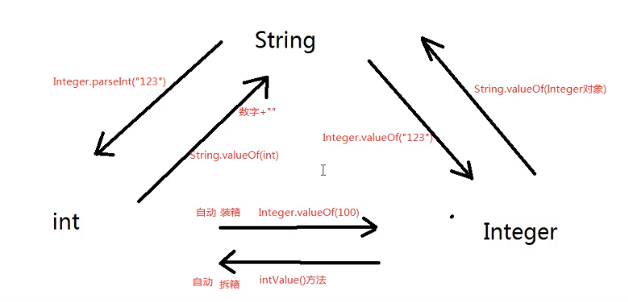

### 日期类

* 简单使用

  ```java
  //构造,无参构造
  Date nowTime = new Date();
  //以毫秒数构造，在1970-01-01 00:00:00 000 加上传入参数
  Data nowTime = new Date(System.currentTimeMillis()-1000*60*60*24);
  //格式化输出，可以自定义
  SimpleDateFormat sdf = new SimpleDateFormat("yyyy-MM-dd HH:mm:ss SSS");
  String nowTimeStr = sdf.format(nowTime);
  System.out.println(nowTimeStr);
  //将String转为Date
  SimpleDateFormat sdf2 = new SimpleDateFormat("yyyy-MM-dd HH:mm:ss SSS");
  Date dateTime = sdf2.parse(time);
  System.out.println(dateTime);
  ```

* 统计函数耗费时间

  System.currentTimeMillis()记录当前距1970年1月1日的时间差多少毫秒，返回用long接收。

  ```java
  long begin = System.currentTimeMillis();
  print();
  long end = System.currentTimeMillis();
  System.out.println(end-begin);
  //===================
  System.out.println();
  System.gc();   //检验启动垃圾回收
  System.currentTimeMillis();
  System.exit(0);     //退出JVM
  System.arraycopy();  //数组复制
  ```

### 数字格式化

```java
/**
	#:代表数字
	,：代表千分位
	.:代表小数点
	0:不够用0补齐
*/
DecimalFormat df = new DecimalFormat("###,###.0000");
String s = df.format(123.12);
//========================
//BigDecimal大数据，精度高于double，一般用于财经类程序
```

### 随机数

```java
Random random = new Random();
int num1 = random.nextInt();
int num2 = random.nextInt(101);   //下一个Int随机数为0-100
```

### 枚举

定义枚举类型的主要目的是：增加程序的可读性。枚举类型最常见也最有意义的用处之一就是用来描述状态量定义枚举类型的主要目的是：增加程序的可读性。枚举类型最常见也最有意义的用处之一就是用来描述状态量。**常与switch连用**

```Java
enum Re sult {
	SUCCESS,FAIL
}
return Result.SUCCESS;
//===================
//c++
enum MyEnum {APPLE,ORANGE,GRAPE};
MyEnum _myEnum = APPLE;
```

## 第十七章 异常

异常是程序中的一些错误，但并不是所有的错误都是异常，并且错误有时候是可以避免的。

* 异常以类的形式存在，每一个异常类都可以创建异常对象。发生异常实际是创建了一个异常对象，并将其抛出。异常对象的实现，构造方法传参是传入一个String。

* 

* 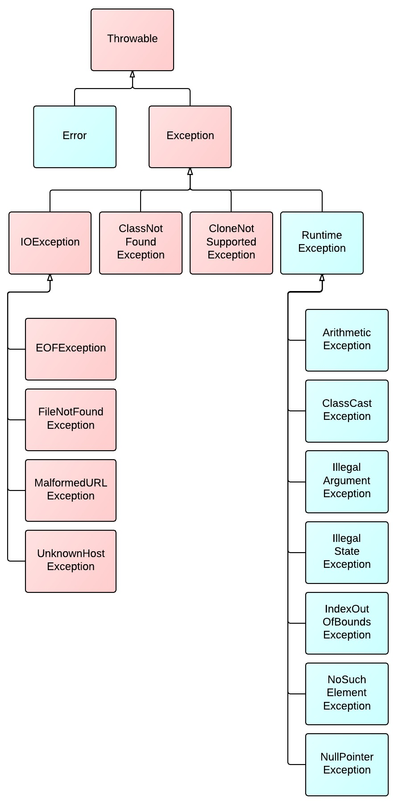

  1. 不管是错误还是异常，Throwable可以抛出。
  2. 所有错误，只要发生，java程序就会终止程序执行。退出JVM，错误类不能处理。
  3. 所有RuntimeException及其子类都是运行时异常(未受检、未受控)。运行时异常你可以在编写程序阶段选择性处理或不处理。
  4. 所有Exception的直接子类，叫做编译时异常(受控、受检异常)，编译时异常是在编译阶段发生吗？不是，编译异常是表示必须在编写程序时预先对这种异常处理，如果不处理编译器抱错。
  5. **所有异常都发生在运行阶段**。

* 编译时异常一般发生概率比较高。运行时异常一般发生概率低。 

* 异常处理的两种方式：

  1. 在方法声明的位置上，使用throws关键字，抛给上一级。
  2. 使用try..catch语句进行异常的捕捉。
  3. 注：往上抛后还是仅有两种方式处理异常。如果异常一直向上抛，最终会到main再到JVM，那么程序最终会终止。

* throws关键字与throw关键字，在类的声明的参数列表之后用。

  ```java
  public static void doSome() throws ClassNotFoundException{
      if(a==b){
          throw new Exception("test");
      }
  }
  //异常不抛出则只是一个普通的java对象
  ```

  注： 向上抛出异常必须与发生异常相同，向上抛出的异常可以是当前异常的父类及以上的类。所以Exception作为被抛出的异常，因为该异常包含了所有异常类。(有点像向上转型)

* 异常的执行顺序，当向上抛出异常时，该方法将从抛出异常的地方中断，并返回函数断点。try中发生异常，从异常的地方停止直接到catch块，try..catch捕捉异常后，后续代码可以执行。

* catch()的参数可以用多态。catch可以写多个。多个catch时，从上到下必须遵守类别继承关系重小到大。

* 如果希望上报者调用处理，选择throws上报。

* 异常中常用的两个方法

  1. getMessage()，返回构建异常对象的字符串
  2. printStackTrace()，打印异常堆栈信息，后台有个线程打印此信息。采用了异步线程的方式。

* finally关键字

  1. 在finally子句中的代码是最后执行的，并且是一定会执行的，即使try请句块中的代码出现了异常，**即使try中return也会执行，先执行finally再return**。finally子句必须和try一起出现，不能单独编写。
  2. finally语句通常使用在哪些情况下呢？**当出现异常后会直接跳到catch块，有时需要在finally中执行一些资源管理从操作。 **
  3. 退出JVM，System.exit(0)出现在try中则不会执行finally。

* 一道面试题：

  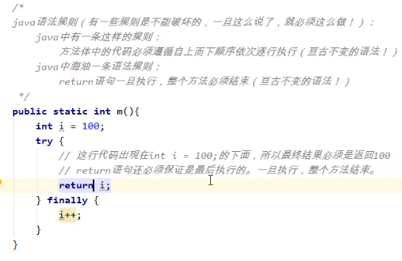

* final、finally、finalize

  final是关键字，修饰变量表示不变。

  finally是关键字，和try连用。

  finalize()是Object中的一个方法，作为方法名出现，是一个标识符。JVM的gc调用。当做析构函数记。

* 自定义异常

  1. 编写一个类，继承Exception或RuntimeException。

  2. 提供两个构造方法，一个无参，一个带String参数。

     ```java
     public class MyException extends Exception{
     	public MyException(){    
         }
     	public MyException(String s){ 
     		super(s);
     	}
     ```

* 子类重写父类之后的方法不能比重写之前的方法抛出更多的（更宽泛的）的异常，可以更少。父类不抛出异常，子类可以抛出RuntimeException。

## 第十八章 集合(容器)

集合不能直接存储基本数据类型，另外集合也不能直接存储java对象，集合当中存储的都是java对象的内存地址。（或者说集合中存储的是引用.),**注：集合只存引用，则基本数据类型需要装箱才能存储。**

注意,集合在java中本身是一个容器，是一个对象。集合中任何时候存储的都是引用

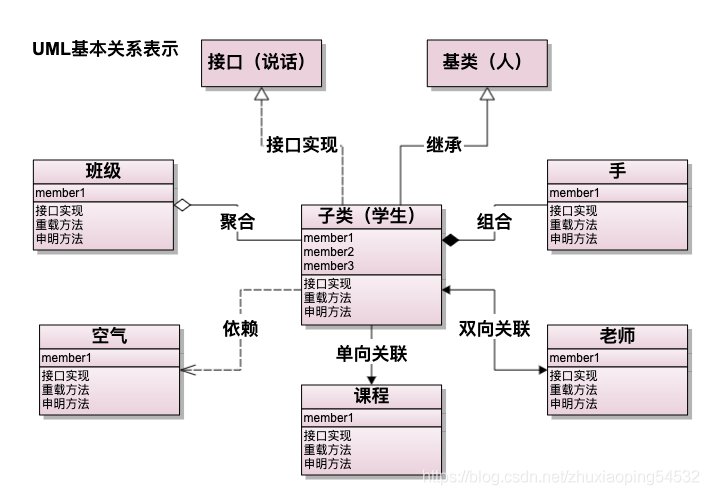

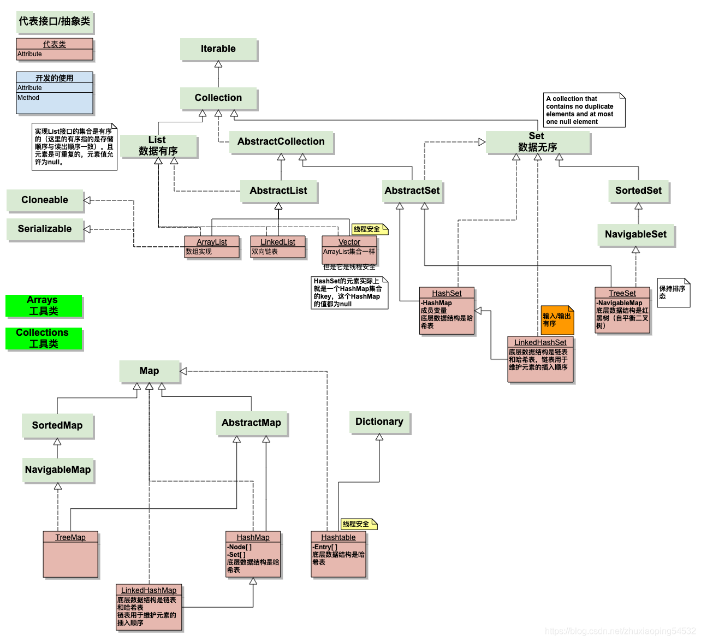

* 元素单个容器对象继承与Collection接口，存储键值对的容器继承于Map
* List有序可重复，可以进行索引。Set无序不可重复，无法索引。
* ArrayList是非线程安全的，而Vector是线程安全的。但是Vector效率低，现在保证线程安全有其他方法，所以Vector用的比较少了现在。
* HashSet集合在new的时候，底层实际上new了一个HashMap集合。HashSet集合中存储元素实际上存储到了HashMap中（Hash数据结构）。TreeSet底层实际上是一个TreeMap（二叉树数据结构）。
* Map中的key与value都是存储在java对象的内存地址。所有Map的key是无序不可重复的。HashMap与HashTable的区别在于后者是线程安全的，但由于效率较低目前不基本不用。
* **注上图没有画出：**Hashtable有一个子类Properties，由于继承与Hashtable所以同样是线程安全的，另外该元素存储元素时候也是键值对，但键值对只支持String类型，不支持其余类型。

### Collection常用方法

+ boolean add(Object e)：向集合中添加元素。
+ int size()：返回容器元素个数。
+ void clear()：清空集合。
+ boolean contains(Object e)：如果此集合包含指定的元素，则返回 `true` 。**contains方法底层是调用了equals方法来判断是否包含某个元素，即比较值而不是比较地址。**
+ boolean remove(Object e)：从该集合中删除指定元素的单个实例（如果存在）（可选操作）。**底层也调用了equals方法。**
+ boolean isEmpyt()：如果此集合不包含元素，则返回 `true` 。
+ Object[] toArray()：返回一个包含此集合中所有元素的数组。(不常用)

### Collection中的遍历(迭代)

1. 获取迭代器。

2. 判断是否还有元素可迭代。

3. 返回下一个元素，并更新迭代器状态。

   ```java
   Iterator it = c.iteratio();
   boolean hasNext = it.hasNext();
   Object obj = it.next();
   while(it.hasNext()){
       Object obj = it.next();
   }
   ```

* **重要结论：存放在Collection中的类型一定要重写equals方法。因为contains和remove都在底层用了equals。**

* 集合只要发生改变，迭代器必须重新获取。若结果发生了变化，迭代器又没有更新，再调用next()会出。在迭代过程中直接对集合元素增删改会导致迭代器抛出异常ConcurrentModificationException。而利用迭代器进行增删改则不会出现异常。例如用迭代器删除元素和集合删除元素，

### List接口常用方法

* void add(int index, object element)，指定位置添加元素，效率低用的少。
* object get(int index)，可以用该方式遍历List。
* int indexOf(Object o)
* int lastIndexOf(object o)
* Object remove(int index)，删除指定下标的元素。
* object set(int index, object element)，修改指定下表的元素。

### ArrayList

+ 默认初始化容量10(底层先创建了一个长度为0的数组，当添加第一个元素的时候，初始化容量10。
+ 集合底层是一个0bject[]数组。
+  构造方法：
  new ArraList();
  new ArrayList(20);
+ 底层扩容是1.5倍。为了提高效率，尽量少扩容。
+ 向数组末尾增加元素效率不受影响，而在其中插入数据是需要移动一定元素的所以效率低。数组无法存储大数据量，因为很难找到大片连续空间。
+ 非线程安全的集合。

### LinkedList

+ 同样有索引下标。

+ 链表的优点：由于链表上的元素在空间存储上内存地址不连续。所以随机增删元素的时候不会有大量元素位移，因此随机增删效率较高。在以后的开发中，如果遇到随机增删集合中元素的业务比较多时，建设使用LinkedList。

  链表的缺点：不能通过数学表达式计算被查找元素的内存地址，每一次查找都是从节点开始逼历，直到找到为止。所以LinkedList集合检索/查找的效率较低。

### Vector

+ 用的很少。线程安全的，但效率低。

### 泛型

泛型提供了编译时类型安全检测机制，该机制允许程序员在编译时检测到非法的类型。泛型的本质是参数化类型，也就是说所操作的数据类型被指定为一个参数。

2、泛型这种语法机制，只在程序编译阶段起作用，只是给编译器参考的。（运行阶段泛型没用！)
3、使用了泛型好处是什么？
第一：集合中存储的元素类型统一了。
第二：从集合中取出的元素类型是泛型指定的类型，不需要进行大量的“向下转型”！
4、泛型的缺点是什么？
导致集合中存储的元素缺乏多样性。
大多数业务中，集合中元素的类型还是统一的。所以这种泛型特性被大家所认可。

+ 定义泛型方法时，必须在返回值前边加一个<T>，来声明这是一个泛型方法，持有一个泛型T，然后才可以用泛型T作为方法的返回值或参数类型等。**如果静态方法要使用泛型的话，必须将静态方法也定义成泛型方法 **

+ 声明泛型还可以在类名后添加<T>，这样在该类下非静态方法就可以使用这个泛型T。

  ```java
  public <E> void show2(E e){}
  
  class GenericClassDemo<T>{}
  ```

  

### HashSet与TreeSet

+ 无序指的是存入与存出顺序是不同的。

+ HashSet元素无序，不重复，底层HashMap。TreeSet元素按一定规则排序，不重复，底层TreeMap。

## 第十九章 Map

Map和Collection没有继承关系。Map集合以Key和Value的方式存储数据，两者都是引用数据类型，都是对象的内存地址。**主导地位是key**。

### HashMap

+ Map常用方法：

  V put(K key,V value)：向Map集合中添加健值对
  V get(object key)：通过key获成value
  void clear()：清空Map集合
  boolean containsKey：(Object key)判断Map中是否包含某个key
  boolean containsValue：(object value)判断Map中是否包含某个value
  boolean isEmpty()：判断Map集合中元素个数是否为
  Set<k> keySet()：获成Map集合所有的key(所有的键是一个set集合）
  V remove(object key)：通过key删除健值对
  int size()：获成Map集合中键值对的个数。
  Collection<V> values()：获取Map集合中所有的value,返回一个Collection
  Set<Map.Entry<K,V>> entrySet()：Map.Entry是一个静态内部类，该方法返回一个Set集合，该集合装的对象就是Map.Entry。

+ Map的两种遍历方式

  方式一：获得Map集合的Key，再通过迭代或foreach方法通过get方法遍历。

  方式二：通过entrySet()方法，获得Set<Map.Entry<K,V>>集合，该集合每个元素看做一个node（也可以理解成一个pair），node.getKey()以及node.getValue()方法可以获取键值对。所以用迭代器或foreach遍历都可。该方法效率高于上面那个方法。

+ 重点：通过讲解可以得出HashMap集合的key,会先后调用两个方法，一个方法是hashCode(),一个方法是equals(),**那么这两个方法都需要重写**。

+ 放在HashMap集合key部分的元素其实就是放到HashSet集合中了。**所以HashSet集合中的元素也需要同时重写hashCode()+equals()方法。**

+ **注意：同一个单向链表上所有节点的hash相同，因为他们的数组下标是一样的。但同一个链表上k和k的equals方法肯定返回的是false,都不相等。**若HashCode方法返回固定值，最终将导致HashMap变成了一条单向列表，单如果全返回不同值，最终底层变成数组，这两种方式都变成了散列分布不均。

+ HashMap集合的默认初始化容量是16,默认加载因子是0.75这个默认加载因子是当HashMap集合底层数组的容量达到75%的时候，数组开始扩容。

+ hashCode()方法和equals()方法不用研究了，直接使用IDEA工具生成，但是这两个方法需要同时生成。

+ 在JDK8之后，如果哈希表单向链表中元素超过8个，单向链表这种数据结构会变成红黑树数据结构。当红黑树上的节点数量小于6时，会重新把红黑树变成单向链表数据结构。

+ 面试题：HashMap的Key和Value值可以为空吗？答案：可以，且可用null进行索引，但null键对应的值只有一个。Hashtable 的key 和value 都是不能为null的。 

### Properties

Properties是一个Map集合，继承Hashtable,Properties的key和value都是String类型。Properties 被称为属性类对象。Properties是线程安全的。

掌握两个方法：

```java
Properties pro = new Properties();
//需要掌握Properties的两个万法，一个存，一个取。
pro.setProperty("url","jdbc:mysql://localhost:3306/bjpowernode");
pro.setProperty("driver","com.mysq1.jdbc.Driver");
pro.setProperty("username","root");
pro.setProperty("password","123");
//通过key获取value
String url = pro . getProperty ( "url" ) ;
String driver = pro.getProperty("driver");
String username=pro.getProperty("username");
String password = pro . getProperty ( " password " ) ;
System.out.println(url);
System.out.println(driver);
System.out.println(asername);
System.out.println(password);
```

### TreeMap

1. TreeSet集合底层实际上是一个TreeMap
2. TreeMap集合底层是一个二叉树。
3. 放到TreeSet集合中的元素，等同于放到TreeMap集合key部分了。
4. TreeSet集合中的元素：无序不可重复，但是可以按照元素的大小顺序自动排序。称为：可排序集合。默认升序

* 自定义类型，必须自定义排序规则后才能实现排序。 即自定义类必须实现java.lang.Comparable接口。

* 放在TreeSet中的元素必须实现接口Comparable中的compareTo方法，可以不实现equals。

* **TreeSet和TreeMap是自平衡二叉树，遵循左小右大存放原则。TreeSet和TreeMap集合采用的是中序遍历方式。Iterator迭代器采用的是中序遍历方式。**由于是中序遍历加左小右大，所以遍历会出现升序。

  大于0往右子树走，小于0往左子树走，相同则覆盖。

  ```java
  //注，this是当前待插入的数据。
  //底层调用：
  //k.compareTo(t.key)
  public int compareTo(Customer c){
  	return this.age - c.age;    
  }
  ```

* 第二种方式实现自定义排序，不用实现接口，而是自定义一个比较器。注：比较器实现java.util.Comparator接口。（Comparable是java.Lang包下的。Comparator是java.util包下的。）

  ```java
  class MyComparator implements Comparator<Custom>{
  	public int compare(Custom c1,Customc2){  // c1->key,c2->t.key
  		return c1.age - c2.age;
  	}
  }
  TreeSet<Custom> customs = new TreeSet<>(new MyComparator());
  //=======================================
  //匿名内部类的实现方式，这个类无名字，直接new接口。
  Set<Custom> customs = new TreeSet<Custom>(new Comparator<Custom>(){
      public int comapre(Custom c1, Custom c2){
          return c1.age-c2.age;
      }
  });
  ```

* 当比较规则不会发生改变的时候，或者说当比较规则只有1个的时候，建议实现Comparable接口。如果比较规则有多个，并且需要多个比较规则之间频繁切换，建议使用Comparator接口。Comparator接口的设计符合OCP原则。

### 集合工具类

```java
/*
java.util.Collection集合接口
java.util.Collections集合工具类，方便集合的操作。
*/
//ArrayList集合不是线程安全的。
List<String> list = new ArrayList<>();
//变成线程安全的
Collections.synchronizedList(list);
//排序
list.add("abf");
list.add("abx");
list.add("abc");
list.add ("abe");
Collections.sort(list);
//注：对List集合中元素进行排序，必须保证List集合中的元素实现了Comparable接口。
//或者传入比较器参数。Collections.sort(list集合，比较器对象);

//若想对Set集合进行排序，得先将Set集合转换为List集合
List<String> muList = new ArrayList<>(set);
```

## 第二十章 IO流

+ IO流的分类

  1. 输入（读）与输出（写）

  2. 字节流与字符流:

     字节流一次读取一个byte即8位，可以读取任意类型文件。

     字符流一次读取一个字符，**方便读取普通文本而存在**，不可读取图片、声音等文件，只能读取纯文本文件，word也不可读取。
  
+ 四大类(均是抽象类)

  1. java.io.InputStream 字节流
  2. java.io.OutputStream 字节流
  3. java.io.Reader 字符流
  4. java.io.Writer 字符流

  所有流都实现了java.io.Closeable接口，都是可关闭的，都有close()方法。注：流使用完后一定要关闭，不然会浪费资源。

  所有输出流都实现了java.io.Flushable接口，都是可刷新的，都有flush()的方法。输出流在最终输出之后，一定要记得flush()刷新一下。这个刷新表示将通道/管道当中剩余未输出数据强行输出完(清空管道)刷新的作用就是清空管道。注：如果没有flush()可能会丢失数据。

+ 现阶段需要掌握的16个流

  文件专属：
  java.io.FileInputStream
  java.io.FileOutputStream
  java.io.FileReader
  java.io.Filewriter
  转换流：(将字节流转换成字符流）
  java.io.InputStreamReader
  java.io.OutputStreamwriter
  缓冲流专属：
  java.io.BufferedReader
  java.io.Bufferedwriter
  java.io.BufferedInputStream
  java.io.BufferedoutputStream
  数据流专属：
  java.io.DataInputStream
  java.io.DataoutputStream
  标准输出流：
  java.io.Printwriter
  java.io.PrintStream
  对象专属流：
  java.io.objectInputStream
  java.io.objectoutputStream

### FileInputStream的使用

+ ### 

  ```java
  FileInputStream fis = null;
          try {
              fis = new FileInputStream("G:\\文档\\test.txt");
              int readDate = 0;
  //            while (true){
  //                int readDate = fis.read();
  //                if(readDate==-1){break;}
  //                System.out.println(readDate);
  //            }
              while((readDate=fis.read())!=-1){
                  System.out.println(readDate);
              }
  //====================read(byte[] bs)==========================
              byte[] bytes = new byte[4];
              //返回一共读到的字节数，未读到字节数返回-1.
              //读取的内容会存到byte数组中，每读一次会在上一次数据上进行覆盖。
              //String构造方法中可以用byte数组作为参数。
              int readCount = fis.read(bytes);
              System.out.println(new String(bytes,0,readCount));
  // =========================最常用的文件读取方式======================
              int readCount = 0;
              while((readCount=fis.read(bytes))!=-1){
                  System.out.print(new String(bytes,0,readCount));
              }
              
                  
          } catch (FileNotFoundException e) {
              e.printStackTrace();
          } catch (IOException e) {
              e.printStackTrace();
          } finally {
              if (fis!=null){
                  try {
                      fis.close();
                  } catch (IOException e) {
                      e.printStackTrace();
                  }
              }
          }
  ```

  注：流开启了一定要在finally中关闭掉，关掉流要确保不出现空指异常。

  获取文件流后，可以用read方法读取字节数据。

+ IDEA默认当前路径是Project根目录。

+ FileInputStream常用方法

  int available():返回流当中剩余的没有读取到的字节数

  long skip(long n):跳过几个字节不读

### FileOutputStream

+ 为什么要有`flush()`？因为向磁盘、网络写入数据的时候，出于效率的考虑，操作系统并不是输出一个字节就立刻写入到文件或者发送到网络，而是把输出的字节先放到内存的一个缓冲区里（本质上就是一个`byte[]`数组），等到缓冲区写满了，再一次性写入文件或者网络。对于很多IO设备来说，一次写一个字节和一次写1000个字节，花费的时间几乎是完全一样的，所以`OutputStream`有个`flush()`方法，能强制把缓冲区内容输出。

  通常情况下，我们不需要调用这个`flush()`方法，因为缓冲区写满了`OutputStream`会自动调用它，并且，在调用`close()`方法关闭`OutputStream`之前，也会自动调用`flush()`方法。

```java
FileOutputStream fos = null;
        try {
            //覆盖原内容
//            fos = new FileOutputStream("test");
            //在原内容基础上追加
            fos = new FileOutputStream("test",true);
            String s = "\n hello world";
            fos.write(s.getBytes());
            s = "耶耶耶";
            fos.write(s.getBytes());
            //写完之后，最后一定要刷新。
            fos.flush();
        } catch (FileNotFoundException e) {
            e.printStackTrace();
        } catch (IOException e) {
            e.printStackTrace();
        } finally {
            if (fos != null) {
                try {
                    fos.close();
                } catch (IOException e) {
                    e.printStackTrace();
                }			 
            }
        }
```

文件的拷贝，是一边读一边写。**关闭流的地方要分开try，因为如果一起try的话出异常会有一个关不掉的情况发生。**

### FileReader与FileWriter

与上面操作基本一致，方法都是read、write。只是操作读取的数据是char类型。同样在写的时候需要在结束进行flush刷新。不同的地方就是new的对象不同。写可以直接传入String。

这两个只能操作普通文本。

### BufferedReader与BufferedWriter

+ **readline**，读取一行不带换行符。**而实际上readLine()是一个阻塞函数，当没有数据读取时，就一直会阻塞在那，而不是返回null**

+ 带有缓冲区的字符输入流。使用这个流的时候不需要自定义char数组，或者说不需要自定义byte数组。自带缓冲。

+ 当一个流的构造方法中需要一个流的时候，这个被传进来的流叫做：节点流。外部负责包装的这个流，叫做：包装流，还有一个名字叫做：处理流。像当前这个程序来说：FileReader就是一个节点流。BufferedReader就是包装流/处理流。

+ 关闭流对于包装流来说，只需要关闭最外层流就行，里面的节点流会自动关闭。

  ```java
  FileReader reader = new FileReader("test.java");
  BufferedReader br = new BuffereReader(reader);
  String s = null;
  while((s=br.readline())!=null){
  	System.out.println(s);
  }
  ```

+ 转换流的使用 InputStreamReader

  ```java
  BufferedReader br = new BufferedReader(new InputStreamReader(new FileInputStream("test.java")))
  ```

### 标准流

**System.out**，是一个常量，是PrintStream的对象，该对象有println等方法。out默认为空，可以通过System.setOut更改。

```
PrintStream out = new PrintStream(new FileOutputStream("log.txt",true));
//修改标准输出流，下面语句将标准输出流从控制台改到了log.txt文件中
System.setOut(out);
System.out.println("test");
```

### 对象专属流

序列化：Serialize java对象存储到文件中。将java对象的状态保存下来的过程。ObjectOutputStream

反序列化：DeSerialize将硬盘上的数据重新恢复到内存当中，恢复成java对象。ObjectInputStream

参与序列化和反序列化的对象必须实现接口Serializable，此接口只是标志接口。java虚拟机看到接口之后，会为该类自动生成一个序列化版本号。

如果要存多个对象，需要使用List集合，对List进行序列化。反序列化也是获得一个List。

关键字：transient(游离的)限制对象中属性不进行序列化。

当实现Serializable后生成序列化版本号，这个版本号主要用来区分类，为了方便后续代码修改，建议手动设置序列化版本号，并且版本号是不变的。如果版本号自动生成，代码修改后版本号也会修改，这样不方便后续修改代码。 


### File类

文件和目录路径名的抽象表达形式。

+ File类不能完成文件的读和写。一个File类对象有可能对应的是目录，也可能是文件。File只是一个路径名的抽象表达形式。

+ File常用方法：

  1. exists()，判断是否存在。
  2. createNewFile()，以文件形式新建（结合存在不存在）
  3. mkdir()，以文件夹形式新建（结合存在不存在）
  4. mkdirs()，以多重文件夹形式新建（结合存在不存在）
  5.  getParent()，获取上级路径，这个返回的是String
  6. getParentFile(),获取上级File，再可通过File的方法getAbsolutePath()获得绝对路径。
  7. getName()，获取文件名。
  8. isDirectory()、isFile()，判断是文件还是目录。
  9. lastModified()，返回文件最后修改的毫秒数。
  10. length()，获取文件大小。
  11. listFiles()，获取目录下所有子目录，返回File[]

  ```java
  File file = new File("test");
  if(!file.exits()){
  	file.createNewFile();
  }
  ```

### IO+Properties联合应用

```java
public class IoPropertiesTest01 {
	public static void main(String[] args) throws Exception{
		/*
		Properties是一个Map集合，key和value都是string类型。
		想将userinfo文件中的数据加载到Properties对象当中。
		*/I
		//新建一个输入流对象
		FileReader reader = new FileReader(fileName:"chapter23/userinfo");
		//新建一个Map集合
		Properties pro = new Properties();
		//调用Properties对象的Load方法将文件中的数据加载到Map集合中。
		pro.load(reader);//文件中的数据顺着管道加载到Map集合中，其中等号=左边做key,右边做value
		//通过key来获取value呢？
		String username = pro.getProperty("username");
		System.out.println(username);
	}
}
```

类似于以上文件称为配置文件，并且以键值对加等号的形式，我们称这种配置文件叫做属性配置文件。java中有规范：属性配置文件检验以.properties结尾。Properties就是专门存在这种文件的类。

属性文件中#注释。

属性文件中不要加空格。冒号可以替换=,但一般还是用=。

### 目录拷贝（找个时间做一下）

## 第二十一章 线程

+ java Helloworld 回车之后会先启动JVM,而JVM就是一个进程。JVM再启动一个主线程调用main方法同时再启动一个垃圾回收线程负责看护，回收垃圾。最起码，现在的java程序中至少有两个线程并发，一个是垃圾回收线程，一个是执行main方法的主线程。

+ 进程是一个应用程序（1个进程是一个软件）。线程是一个进程中的执行场景/执行单元。一个进程可以启动多个线程。

+ 进程之间内存独立不共享。进程独立，不共享资源。在java中，线程A和线程B，堆内存和方法区内存共享。但是栈内存独立，一个线程一个栈。

+ 线程的一种实现方法，首先必须创建一个线程类，继承Thread，并且重新run方法。然后new一个线程对象，并且启动线程。start()方法的作用：启动一个分支线程，在JVM中开辟一个新的栈空间，这段代码任务完成之后，瞬间结束，线程启动成功。启动成功的线程自动调用run方法，并且run方法在分支栈的栈底部。run方法在分支栈的底部，main方法在主栈的底部。run和main平级。

  ```java
  public static void main(){
      MyThread mt = new MyThread();
      mt.start();
      for(int i=0;i<10;i++){
  	System.println("主线程" + i);
  	}
  }
  
  
  class MyThread extends Thread{
  	public void run(){
  		for(int i=0;i<10;i++){
  			System.println("线程" + i);
  		}
  	}
  }
  ```

+ 实现线程的两种方式

  1. ```java
     ///第一种方式：编写一个类，直接继承java.lang.Thread,重写run方法。
     /定义线程
     public class MyThread extends Thread{
     	public void run(){
             
         }
     }
     //创建线程对象
     MyThread t = new MyThread();
     //启动线程
     t.start();
     ```

  2. ```java
     //第二种方式：编写一个类，实现java.lang.Runnable接口，实现run方法。
     public class MyRunnable implements Runnable{
         public void run(){
             
         }
     }
     //创建线程对象
     Thread t = new Thread(new MyRunnable);
     //启动线程
     t.start();
     //这种方法还可以new Runnable(){}，用匿名内部类的方法。
     ```

  注：一般选用第二种方法，因为该方法实现接口还可以继承其他类，更灵活。

+ 线程的生命周期

  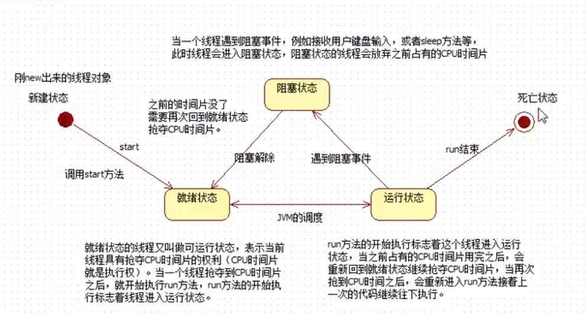

+ 获取当前线程

  静态方法：Thread.currentThread()。谁调用该方法，这个就返回当前线程对象 。同时利用实例方法Thread.getName()、Thread.setName()可以获取和设置线程名字。

+ 线程sleep方法:

  该方法是**静态方法**，其参数是毫秒。Thread.sleeep(1000);

  作用：让**当前线程进入休眠**，进入"阻塞状态"，放弃占有CPU时间片，让给其他线程使用，哪一个线程执行该代码那一个线程就会进入阻塞态。

  Thread.sleep()方法，可以做到间隔特定的时间，去执行一段特定的代码，每隔多久执行一次。

  **面试题：若main中new了一个Thread对象t，t.sleep最终被挂起的是main线程。因为sleep是一个静态方法。**

+ 注：在重写Runnbale接口run方法时，不能抛出异常，为什么？因为子类重写父类方法时，不能抛出更宽或更多的异常。run方法中的异常只能try catch。 

+ **中断睡眠**，唤醒线程的方法(假设已有线程对象t)：t.interrupt();  

  这种中断睡眠的方式，利用了java处理异常的方式。

  ```java
  public static void main(){
  	Thread t = new Thread(new MyRunnable);
      t.start();
      t.interrupt();
      
  }
  
  class MyRunnable implements Runnable{
      try{
          Thread.sleep(1000*60*60);
      }catch(Exception e){
          e.printStackTrace();
      }
  }
  ```

+ 中止线程，t.stop()。目前已不用此方法，因为这种方法直接关闭线程，不保存信息。

  **合理中止线程**

  ```java
  public static void main(){
  	MyRunnable m = new MyRunnable();
      Thread t = new Thread(m);
      t.start();
      //关闭线程
      m.run = false;
      
  }
  
  class MyRunnable implements Runnable{
      boolean run = true;
      for(int i=0;i<100;i++){
          if(run){
          	System.out.println(i);    
          }
          else{
              //save...
              
              //结束线程
              return;
          }
      }
  }
  ```

### 线程的调动

+ 常见线程调动模型：

  1. 抢占式调度才型：那个线程的优先级比较高，抢到的cpu时间片的概率就高一些/多一些。java采用的就是抢占式调度模型。
  2. 均分式调度模型：平均，配CPU时间片。每个线程占有的cpu时间片时间长度一样。有一些编程语言，线程调度模型采用的是这种方式。

+ 线程调度相关的方法：

  1. 实例方法：

     void setpriority(int newPriority)设置线程的优先级

     int getpriority()获取线程优先级

     最低优先级1，默认优先级是5，最高优先级10，优先级比较高的获取cpu时间片可能会多一些。（但也不完全是，大概率是高的。）

     void join()，线程合并。

     ```
     Thread t = new Thread(new MyRunnable());
     t.start();
     try{
     	t.join()//t合并到当前线程中，当前线程受阻塞，t线程执行到结束才会让出执行权给当前线程。
     }catch(Exception e){
     	e.printStackTrace();
     }
     ```

     

  2. 静态方法：

     static void yield()让位方法暂停当前正在执行的线程对象，并执行其他线程yield()方法不是阻塞方法。让当前线程让位，让给其它线程使用yield()方法的执行会让当前线程从"运行状态"回到·就绪状态"。注：回到就绪态后可能继续抢占CPU。

### 线程并发的安全问题

+ 出现数据安全问题的条件：

  1. 多线程并发。
  2. 有共享数据。
  3. 共享数据有修改行为。

+ 如何解决线程安全问题：

  线程排队执行（不能并发），用排队执行解决线程安全问题。这种机制叫做**线程同步机制**。

+ 两种编程模型

  1. 异步编程模型：线程t1和线程t2,各自执行各自的，t1不管t2,t2不管t1,谁也不需要等谁，这种编程模型叫做：异步编程模型。其实就是：多线程并发（效率较高。）异步就是并发。
  2. 同步编程模型：线程t1和线程t2,在线程t1执行的时候，必须等待t2线程执行或在t2线程的时候必须等待t1线程执行结两个线程之间发生待关系这就是同步编程模型。效率较低。线程排队执行。同步就是排队。

+ **关键字synchronized**，线程同步代码块。语法：

  ```java
  //共享对象的选择：
  //假设目前有3个线程T1、T2、T3，现在希望T1、T2同步排队，而不希望T3进行排队
  //则该共享对象只能填T1、T2的共同操作的对象
  synchronized(共享对象){
      //线程同步代码块
  }
  ```

  **java中每个对象都有一把锁**，假设t1、t2线程并发，假设t1执行了，t1遇到关键字synchronized字后，会将其括号里的对象锁住，此时其他线程再想对该对象进行操作是不行的，只有等待t1线程结束，归还对象锁，t2才能对对象进行操作。

  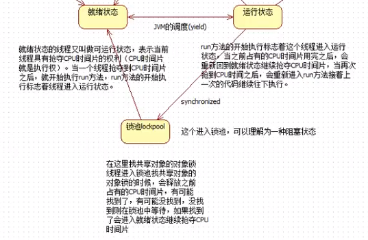

+ 局部变量在栈中，一个线程一个栈所以局部变量不会出现数据安全问题。静态变量在方法区，实例变量在堆中，这两个可能会出现数据安全问题。

+ synchronized块越大，相对效率越低。

+ synchronized可以在实例方法上使用，但此方法锁的对象一定是this，缺乏灵活性。出现在实例方法上，表示整个方法都是同步代码块，可能会应扩大代码区导致效率低。优点：简洁。如果确实共享对象是this且整个方法需要同步，建议使用该方式。

+ StringBuffer是线程安全的，StringBuilder是非线程安全的。所以使用局部变量的时候用StringBuilder效率高于StringBuffer。

+ ArrayList是非线程安全的，Vector是线程安全的。HashMap、HashSet是非线程安全的，Hashtable是线程安全的。

+ 第三种锁的方式，用类锁，100个对象1个类锁。当静态方法被synchronized修饰，则锁是类锁，就算对象不同但同一类都会需要等待同步执行。

+ synchronized最好不要嵌套使用，因为这样可能出现死锁现象。

+ 开发过程解决线程安全问题的三种方案：

  1. 尽量使用局部变量代替"实例变量和静态变量"
  2. 如果必须使用实例变量，那么可以考虑创建多个对象。
  3. 如果不能使用局部变量且不能创建多个对象，则用synchronized。

### 守护线程

+ java中线程分为两类：

  1. 用户线程
  2. 守护线程（后台线程），eg：垃圾回收线程

+ 守护线程的特点：一般守护线程是一个死循环，所有的用户线程只要结束，守护线程自动结束。

  注：main方法是一个用户线程。

+ setDaemon(true)方法可以将线程设置为守护线程，则只要用户进程全部结束，守护进程也结束。

### 定时器

+ 作用：间隔特定的时间，执行特定的程序。java.util.Timer类下写好了一些定时器可以直接拿来用。目前实际开发中，大多框架如spring只需进行简单配置，就可以完成定时器任务。

+ ```java
  public class TimerTest {
      public static void main(String[] args) {
          Timer t = new Timer();
          SimpleDateFormat sdf = new SimpleDateFormat("yyyy-MM-dd HH:mm:ss");
          Date firstTime = null;
          try {
              firstTime = sdf.parse("2021-05-05 23:08:20");
          } catch (ParseException e) {
              e.printStackTrace();
          }
          //间隔时间又是毫秒
          //TimerTask可以用匿名内部类
          t.schedule(new LogTimerTask(),firstTime,1000*2);
  
      }
  }
  class LogTimerTask extends TimerTask{
  
      @Override
      public void run() {
          Date nowtime = new Date();
          SimpleDateFormat sdf = new SimpleDateFormat("yyyy-MM-dd HH:mm:ss");
          String time = sdf.format(nowtime);
          System.out.println(time);
      }
  }
  ```

  

### 实现线程的第三种方式

+ jdk8新特性，这种方式实现的线程可以获取线程的返回值。之前的两种方式都无法获取线程返回值，因为run方法返回void。这种方式在java.util.concurrent.FutureTask，在JUC包下，属于java并发包，老JDK中没有此包。

+ Callable接口，该接口中有个call方法，可以理解为能够返回的run。

  ```java
  FutureTask task = new FutrueTask(new Callable(){
  	public Object call() throws Exception{
  	
  	}
  });
  Thread t = new Thread(task);
  t.start();
  //！！注：这个get()可能会阻塞当前线程。
  Object obj = task.get();
  ```

  

### 关于Object类中的wait和notify方法。

+ wait与notify方法是Object自带的，每个对象都有。

+ wait()与notify()的作用：

  ```java
  Object obj = new Object();
  //让正在obj对象上活动的线程进入等待状态，无期限等待直到被唤醒位置。
  obj.wait();//方法的调用，会让当前线程进入等待状态。
  //唤醒正在obj对象上等待的线程。
  obj.notify();
  //唤醒obj对象上所有的线程。
  obj.notifyAll();
  ```

+ 1、notify只会随机选取一个处于等待池中的线程进入锁池去竞争获取锁的机会；

  2、notifyAll会让所有处于等待池的线程全部进入锁池去竞争获取锁的机会；

+ 注：obj.wait()方法会让正在obj对象上活动的线程进入等待状态，并且释放之前占有的obj对象的锁。obj.notify()方法只会通知，不会释放之前占有的obj对象的锁。

  **wait、notify方法都是建立在synchronized线程同步基础之上。**

## 第二十二章 反射

+ 反射机制可以通过java语言操作字节码文件。通过反射机制可以操作代码片段。反射机制相关类在java.lang.reflect.*包下。
+ 反射机制相关重要类：
  1. java.lang.class:代表整个字节码，代表一个类型。
  2. java.lang.reflect.Method:代表字节码中的方法字节码。
  3. java.lang.reflect.Constructor:代表字节码中的构造方法字节码。
  4. java.lang.reflect.Field:代表字节码中的属性字节码。代表成员变量(静态、实例)

### 获取字节码的三种方式

+ Class.forName():
  该方法是静态方法、方法的参数是一个字符串、字符串需要的是一个完整类名、完整类名必须带有包名。

  ```java
  Class c1 = java.lang.String;
  ```

+ Java中Object对象都有一个方法:getClass()。

  ```java
  String s = “abc”;
  Class x = s.getClass();
  ```

  此时x就是字符串的字节码。注：字节码文件装置到JVM中只有一个。

+ java语言任何一种类型，包括基本数据类型，它都有.class属性。

  ```java
  Class z = String.class;
  Class k = int.class;
  ```

+ 利用反射机制实例化对象，获取Class，通过Class对象的newInstance()方法实例化对象，内部实际上调用了无参构造方法。

+ java代码写一次，不用再改代码，利用反射机制，可以做到不同对象的实例化，非常灵活。

+ 如果只希望一个类的静态代码块执行，其他代码一律不执行。可以利用Class.for Name(“完整类名”)，这个方法的执行会导致类加载，类加载时，静态代码块执行。jdbc中应用

### 如何获取绝对路径

+ 凡事在src文件下都是类路径下，src是类的根路径。
+ 获取绝对路径：

```java
String path = Thread.currentThread().getContextClassLoader().getResource(“文件名”).getPath();
//注：文件名要从src开始写相对路径
//getContextLoader()是线程对象的方法，可以获取到当前线程的类加载器对象。
//getResource()这是类加载器对象方法，当前线程的类加载器默认从类的根路径下加载资源。
```

### 资源绑定器

+ 资源绑定器，在java.util包中，便于获取属性文件的内容。这种方法**只能获取在类路径下的.properties文件**。获取时，路径不需要带上后缀名。

  ```java
  ResourceBundle bundle = ResourceBundle.getBundle(“文件名不带后缀”);
  //用key值获取对应的value
  String className = bundle.getString(key:“className”);
  //用这种方法可以代替IO+Properties的方法。
  ```

### 反射获取Field

+ 实例方法Class.getFields()只能获取public修饰的字段。
+ 实例方法Class.getDeclaredFields();可以获取所有字段。
+ 实例方法Class.getType()可以获得字段的类型。
+ 实例方法Class.getModifiers()可以获得字段的修饰符的代号，是int数字。再通过静态方法Modifier.toString(int i)即将数字转为字符串

### 通过反射机制访问对象属性

```java
Class studentClass = Class.forName("com.Student");
Object obj = studentClass.newInstance();
Field noField = studentClass.getDeclaredField("no");
noField.set(obj,222);
noField.get(obj);
////====================
//对于私有属性，可以通过打破封装进行访问
nameField.setAccessible(true);
nameField.set(obj,”Jackson”);
```

### 可变长参数

```java
public static void m(int... args){
	int length = args.length;
	//args即是可变长参数，可以当数组访问。
}
```

+ 可变长参数列表只能出现一个，且只能在最后位置上。可变长参数可以当数组看待。可以直接传一个数组。

### 反射获取Method

+ 重点：通过反射机制调用一个对象的方法。**invoke()**

  ```java
  //括号里面是参数列表的形式，实际中应该传相应的参数。
  //获取方法，通过函数名+函数的参数列表 确定函数
  //(函数名,String.class,String.class)
  Method = loginMethod = userServiceClass.getDeclaredMethod(String name,Class<?>... parameterTypes);
  //调用方法
  //如下参数中：第一个是调用对象，后面两个是参数
  Object retValue = loginMethod.invoke(obj,"admin","123");
  ```

+ 反射机制让代码很具有通用性，可变化的内容都是写到配置文件当中，将来修改配置文件之后，创建对象不一样，调用的方法也不同了，但是java代码不需要改。

### 反射获取Constructor

+ 通过反射创建对象

  ```java
  //无参数构造
  Constructor con = c.getDeclaredConstructor();
  //有参构造函数,下面的参数是对应构造函数的参数Class
  Constructor con = c.getDeclaredConstructor(int.class,String.class,String.class,boolean.class);
  //构造对象
  Object obj = con.newInstance(110,”ng”,”1990-04-22”,true);
  ```

+ 反射获取父类

  ```java
  Class superClass = String.class.getSuperclass();
  ```

+ 反射获取接口

  ```java
  Class[] interfaces = String.class.getInterfaces();
  ```

## 第二十三章 注解

注解，Annotation是一种引用数据类型，编译之后也是会产生xxx.class文件。

* 自定义注解
  语法：修饰符 @interface 注解名{}
* 注解使用时语法格式时@注解类型名，可以出现在类、属性、方法、变量等上。
* jdk内置注解
  1. Deprecated：用@Deprecated注释的程序元素，不鼓励程序员用这样的元素，通常是因为它很危险或存在更好的选择。
  2. Override，表示一个方法声明打算重写超类中的另一方方法声明。
  3. SuppressWarnings，指示应该在注释元素(以及包含在该注释元素中的所有程序元素)中取消显示指定的编译器警告。

### 元注解

+ 用来标注"注解类型"的"注解"，称为元注解。常见的元注解：Targer、Retention

+ 关于Target注解:用来标注被标注的注解可以出现在哪。

+ 关于Retention注解：用来标注被标注的注解最终保存在哪。

  ```java
  //标识被标识的注解只能出行在方法上
  @Target(ElementType.METHOD)
  //这个注解标识可以出现在构造方法、字段、....等
  @Target(value={CONSTRUCTOR , FIELD , LOCAL_VARIABLE , METHOD , PACKAGE , MODULE , PARAMETER,TYPE})
  @Retention(RetentionPolicy.SOURCE)//:表示该注解只被保留在java源文件中。
  @Retention(RetentionPolicy.CLASS)//:表示该注解被保存在class文件中。
  @Retention(RetentionPolicy.RUNTIME)//:表示该注解被保存在class文件中，并且可以通过反射机制获取。
  ```

### Override

+ @Override这个注解只能注解方法，这个注解是给编译器参考的，和运行阶段无关。凡是java中的方法带有这个注解，编译器都会进行编译检查，如果这个方法不是重写父类的方法，编译报错。这是一个**标识性注解**。

### Deprecated

+ 在方法上加上该注解，标识该方法已过时。

### 自定义注解

+ 注解中可以定义属性，如果注解中有属性，则在使用注解时一定要给属性赋值。

  ```
  public @interface MyAnnotation{
  	String name();
  	String color();
  	int age() default 25;
  }
  @MyAnnotation(name="ng",color="red")
  ```

+ **如果一个注解的属性名是value，且只有一个属性，可以省略value=，**

+ 属性的类型可以是byte short int long float double boolean char String Class 枚举类以及以上每一种的数组形式。如果数组中只有一个元素，大括号可以省略。

+ **注解联合反射机制可以对代码进行检查和限制。**