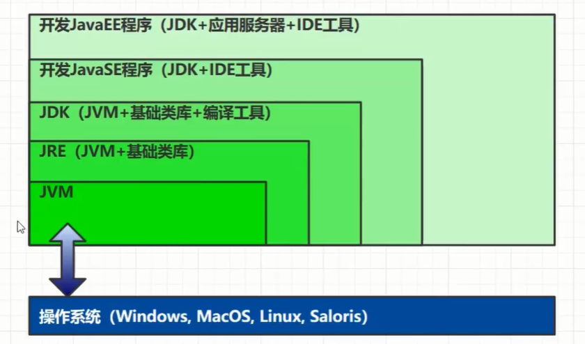
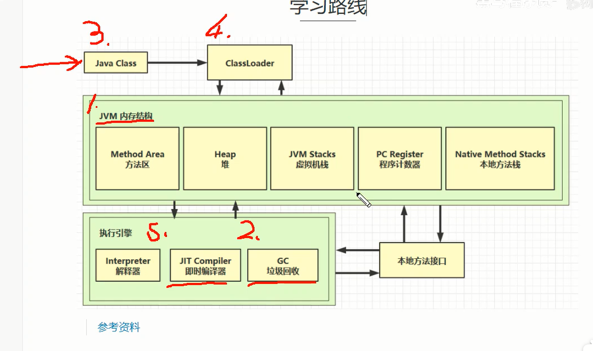

# JVM

## 第一章 概述

### jvm、jre、jdk之间的关系

+ 

### 学习路线

+ 

## 第二章 JVM内存结构

### 程序计算器：

+ 定义：
  + 作用：pc其实就是程序指针，记录下一条指令执行地址
  + 特征：线程私有、程序计数器不存在内存溢出

### 虚拟机栈：

+ 定义：
  + 每个线程运行时所需要的内存，称为虚拟机栈
  + 每个栈由多个栈帧（Frame)组成，对应着每次方法调用时所占用的内存
  + 每个线程只能有一个活动栈帧，对应着当前正在执行的那个方法
+ 问题辨析
  + 垃圾回收是否涉及栈内存？否，栈帧调用结束，其内存自动释放。
  + 栈内存越大越好？否，栈内存大小与线程数量有相关关系。
  + 方法内部的局部变量是否线程安全？
    + 如果方法内局部变量没有逃离方法的作用访问，它是线程安全的
    + 如果是局部变量引用了对象，并逃离方法的作用范围，需要考虑线程安全

