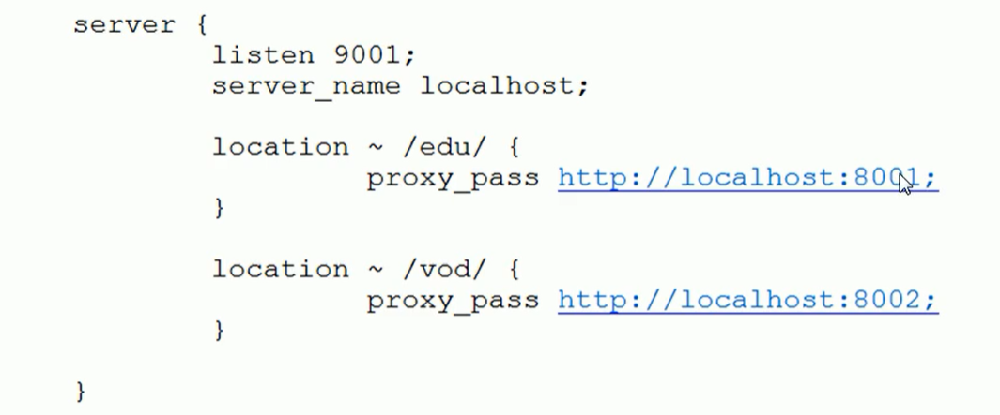

# Nginx

## 一、安装以及简单命令

+ https://www.cnblogs.com/liujuncm5/p/6713784.html

## 二、Nginx配置文件

### 2.1 配置文件位置

+ `/usr/local/nginx/conf/nginx.conf`

### 2.2 配置文件结构

+ 全局块
  + 定义：第一块，events块之间的内容，主要会设置一些影响nginx服务器整体运行的配置指令。
  + `worker_processes = 1 `该代码配置线程数。
+ events块
  + 定义：第二块，配置服务器与用户网络连接部分。
  + `worker_connections = 1024`
+ http块
  + 定义：Nginx中配置最频繁的一部分，代理、缓存和日志定义等绝大多数功能和第三方模块的配置都在这里。http块中包括http全局块、server块。 
    1. http全局块：配置的指令包括文件引入、MIME-TYPE定义、日志自定义、连接超时时间、单链接请求数上限。
    2. server块：每个http块有多个server块，每个server块相当于一个虚拟主机。每个server块也分为全局server块，以及可同时包含多个location块。
       + 全局server块最常见的配置是本虚拟机主机的监听配置和本虚拟主机的名称或IP配置。
       + location块

### 2.3 nginx配置实例-反向代理

+ 实现效果：服务器对外暴露外部Nginx的端口号，Nginx反向代理到Tomcat端口上。

+ 访问过程：

  

+ 具体步骤：

  + windows系统的host文件进行域名和ip对应关系配置。

  + nginx进行请求转发（反向代理）

    

### 2.4 nginx反向代理实例二

+ 实现效果：使用nginx反向代理，根据访问路径的跳转到不同端口的服务中，nginx监听9001端口，访问http://127.0.0.1:9001/edu 直接跳转到127.0.0.1:8080。访问http://127.0.0.1:9001/vod 直接跳转到 127.0.0.1:8081

  

+ location指令说明

  + 该指令用于匹配URL。语法如下：`location [=|~|~*|^~] uri{}`
  + 

### 2.5 nginx配置实例-负载均衡

+ 实现效果：浏览器访问`http://47.99.82.240/edu/a.html`,负载均衡效果，平均8080和8081端口中。会把每一次请求进行均衡。
+ 准备工作：(1)分别在端口8080和8081开启tomcat、(2)两个tomcat中的webapps创建edu文件夹放入a.html文件夹
+ nginx进行负载均衡配置。
  1. http块中添加，需要负载均衡的服务器列表
  2. server块中的location中添加
+ nginx均衡的策略
  1. 轮询(默认)
  2. weight
  3. ip_hash:配置文件中加入`ip_hash;`。其作用是：每个请求按访问ip的hash结果分配，这样每个访客固定访问一个后端服务器，可以解决session的问题。
  4. fair(第三方)，按后端服务器响应时间来分配请求，响应时间短的优先分配。

### 2.6 nginx配置实例-动静分离

+ 什么是动静分离

+ 浏览器静态资源缓存：不常变动的资源可以通过配置文件中设置参数expires。设置expires=3d表示3天之内访问这个url，发送一个请求对比最后修改时间，若没有改动则不会从服务器抓取，返回状态码304。

+ 实现效果：浏览器可以直接访问linux中的文件(一般设置为静态文件)。

+ 准备工作： linux中设置静态资源/data/image与/data/www

+ 具体配置：

  

  **注：**`=`是前缀匹配，还有就是uri匹配应该算是端口号之后的部分。

## 三、Location

语法规则： `location [=|~|~*|^~] /uri/ { … }`

- `=` 开头表示精确匹配
- `^~` 开头表示uri以某个常规字符串开头，理解为匹配 url路径即可。nginx不对url做编码，因此请求为/static/20%/aa，可以被规则^~ /static/ /aa匹配到（注意是空格）。以xx开头
- `~` 开头表示区分大小写的正则匹配           以xx结尾
- `~*` 开头表示不区分大小写的正则匹配        以xx结尾
- `!~`和`!~*`分别为区分大小写不匹配及不区分大小写不匹配 的正则
- `/` 通用匹配，任何请求都会匹配到。

## 四、网络模式

