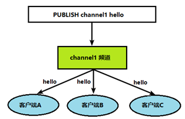

# Redis

## 一、安装

+ 默认安装目录:`/usr/local/bin/`，**这个文件下的命令是可以全局使用的**
+ 默认安装目录
  1. redis-benchmark:性能测试工具，可以在自己本子运行，看看自己本子性能如何。
  2. redis-check-aof：修复有问题的AOF文件，rdb和aof后面讲
  3. redis-check-dump：修复有问题的dump.rdb文件
  4. redis-sentinel：Redis集群使用
  5. **redis-server**：Redis服务器启动命令
  6. **redis-cli**：客户端，操作入口
+ 启动
  1. 前台启动:`redis-server`
  2. 后台启动:`redis-server /etc/redis.conf`
+ 与Memcache的不同点
  + 支持多数据类型，支持持久化，单线程+多路IO复用

## 二、redis常用数据类型

### 字符串(String)

+ String类型是二进制安全的。意味着Redis的string可以包含任何数据。比如jpg图片或者序列化的对象。String类型是Redis最基本的数据类型，一个Redis中字符串value最多可以是512M
+ incr/decr操作在redis中均执行的是原子操作。 
+ **数据结构**：动态字符串，内部结构类似`ArrayList`或者理解成 `vector<String>`
+ 常用命名：
  1. set
  2. get
  3. append
  4. strlen
  5. setnx:只有key不存在时设置value
  6. incr/decr
  7. incrby/decrby
  8. mset：同时设置多个
  9. mget
  10. msetnx
  11. getrange
  12. setrange
  13. setex：设置过期时间。ttl 查看剩余时间
  14. getset:以旧换新

### 列表(List)

+ 底层实际是一个双向链表，对两端的操作性能很高，通过索引下标的操作中间的节点性能会较差。

+ 值在键在，值光键亡。

+ **数据结构**:quicklist

  压缩列表(ziplist):首先在列表元素较少的情况下会使用一块连续的内存存储，这个结构是ziplist，也即是压缩列表。

  当数据量比较多的时候才会改成quicklist。因为普通的链表需要的附加指针空间太大，会比较浪费空间。比如这个列表里存的只是int类型的数据，结构上还需要两个额外的指针prev和next。

  

+ 常用命令：

  1. lpush/rpush
  2. lpop/rpop
  3. rpoplpush：从\<key1>列表右边吐出一个值，插到\<key2>列表左边
  4. lrange:lrange key 0 -1
  5. llen
  6. linsert 
  7. lrem:从左边删除n个

### 集合(set)

+ Redis set对外提供的功能与list类似是一个列表的功能，特殊之处在于set是可以**自动排重**的，**当你需要存储一个列表数据，又不希望出现重复数据时**，set是一个很好的选择，并且set提供了判断某个成员是否在一个set集合内的重要接口，这个也是list所不能提供的。
+ Redis的Set是string类型的无序集合。它底层其实是一个value为null的hash表，所以添加，删除，查找的**复杂度都是O(1)**。
+ **数据结构**：Set数据结构是dict字典，字典是用哈希表实现的。Java中HashSet的内部实现使用的是HashMap，只不过所有的value都指向同一个对象。Redis的set结构也是一样，它的内部也使用hash结构，所有的value都指向同一个内部值。
+ 常用命名
  1. sadd
  2. smembers:取出集合的所有值
  3. sismember：判断是否是集合的值
  4. scard:返回该集合个数
  5. srem
  6. spop:随机吐出
  7. srandmember：随机取出n个值不删除
  8. smove
  9. sinter：返回俩集合的交集
  10. sunion：返回俩集合的并集
  11. sdiff：返回俩集合的差集

### 哈希(Hash)

+ 数据结构:Hash类型对应的数据结构是两种：ziplist（压缩列表），hashtable（哈希表）。当field-value长度较短且个数较少时，使用ziplist，否则使用hashtable。

+ 常用命名：

  

### 有序集合(Zset)


## 三、redis配置文件

+ 位置：/e

### Units单位

+ 配置大小单位，开头定义了一些基本的度量单位，只支持bytes，不支持bit，大小写不敏感。

### Includes包含

### Network

+ **bind**:默认情况bind=127.0.0.1只能接受本机的访问请求不写的情况下，无限制接受任何ip地址的访问，生产环境肯定要写你应用服务器的地址；服务器是需要远程访问的，所以需要将其注释掉。如果开启了protected-mode，那么在没有设定bind ip且没有设密码的情况下，Redis只允许接受本机的响应
+ **protected-mode**，将本机访问保护模式设置no。
+ port，端口号。
+ tcp-backlog。
+ timeout，客户端空闲多久关闭。设置为0则永不关闭。
+ tcp-keepalive，tcp请求空闲维持时间。
+ **daemonize**，是否为后台进程。
+ pidfile、loglevel、logfile、datebases、

### SECURITY安全

+ 密码，**requirepass**


## 四、发布与订阅

+ 一种消息的通信方式。

  在redis客户端之间可以实现该功能

  订阅：

  发布：

+ 具体命名：

  ```redis
  //客户端1
  subscribe channel1
  //客户端2
  publish channel1 hello
  ```

## 五、redis新数据类型

### bitmap

### hyperLogLog

+ 用来计算基数的数据类型，基数：即不重复数字的总数。由于set、hash等方式在面对大数据情况下占内存过多，所以提出了该数据类型。

### Geospatial

+ Redis 3.2 中增加了对GEO类型的支持。GEO，Geographic，地理信息的缩写。该类型，就是元素的2维坐标，在地图上就是经纬度。redis基于该类型，提供了经纬度设置，查询，范围查询，距离查询，经纬度Hash等常见操作。

## 六、jedis

## 七、redis整合springboot

## 八、redis事务

### 定义

+ Redis事务是一个单独的隔离操作：事务中的所有命令都会序列化、按顺序地执行。事务在执行的过程中，不会被其他客户端发送来的命令请求所打断。**Redis事务的主要作用就是串联多个命令防止别的命令插队。**

### Multi、Exec、discard

+ 

+ 错误情况

  1. 

     队列阶段出错，则在exec阶段就不会执行，整个队列都会取消，例如命令出错。

  2. 

     如果执行阶段某个命令报出了错误，则只有报错的命令不会被执行，而其他的命令都会执行，不会回滚。

  ### 事务的意义

  + 原子性，要么整个指令都成功，要么都失败。

  ### 事务冲突(个人感觉有点像多线程问题)

  + 悲观锁：排队操作，操作上锁。

    

  + 乐观锁；并行操作，操作完成更新版本号，操作前查询自己版本号与当前版本号。

    

  + 乐观锁的实现

    watch命名解决问题
  
  ### redis事务的三特性
  
  + 单独的隔离操作，事务中的所有命令都会序列化、按顺序地执行。事务在执行的过程中，不会被其他客户端发送来的命令请求所打断。 
  
  + 没有隔离级别的概念，队列中的命令没有提交之前都不会实际被执行，因为事务提交前任何指令都不会被实际执行
  + 不保证原子性，事务中如果有一条命令执行失败，其后的命令仍然会被执行，没有回滚 

## 九、redis秒杀案例

### 操作原理


### 存在问题及解决方案

+ 超卖：事务+乐观锁
+ 连接超时：连接池解决问题。(**有待深入了解**)
+ 库存遗留问题：LUA脚本，这个东西**一段**程序执行时都不会被打断。个人感觉可以看成锁。


## 十、redis持久化——RDB

+ 简介：在指定的时间间隔内将内存中的数据集快照写入磁盘， 也就是行话讲的Snapshot快照，它恢复时是将快照文件直接读到内存里

## 十一、AOF


## 十二、主从


[阿里云 Ubuntu 搭建 docker redis 主从+哨兵（1主2从3哨兵）_追梦的疯子-CSDN博客](https://blog.csdn.net/qq_31806155/article/details/104695896)

主从切换后怎么告知客户端：[0072-redis哨兵模式下客户端感知主节点切换_登峰小蚁-CSDN博客_redis主从切换客户端如何感知](https://blog.csdn.net/wrongyao/article/details/104956538)

+ 哨兵

  Java连接redis sentinel，哨兵模式下不要直连master，要连sentinel，master挂了才会自动故障转移

## 十三、


