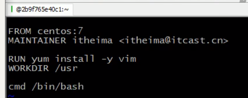

# Docker

## 零、linux准备

## 1、vm

## 2、阿里

+ centos7.8

+ 服务器ip、密码：

  ``` ip:47.99.82.240 password:wu970216bu...``` 

+ 宝塔

  

## 一、概述

+ Docker可以让开发者打包他们的应用以及依赖包到一个轻量级、可移植的容器中，然后发布到任何流行的Linux机器上。
+ 小结：docker是一种容器技术，解决软件跨环境迁移的问题
+ 基本概念：host里有镜像和容器的概念，相对应的就是类和实例。镜像来自于厂库，厂库有官方和私服的区别。

## 二、操作

1. 安装
2. 初用：
   + 启动：``` systemctl start docker```
   + 测试：```docker run hello-world```
   + 停止: ```systemctl stop docker```
   + 状态查看:```systemctl statuss docker```
   + 开机启动:```systemctl enable docker```
3. 命令：
   + 镜像相关命令：
     + 查看: `docker images`
     + 搜索:`docker search redis(镜像名)`
     + 拉取:`docker pull redis:5.0(镜像版本号)`
     + 删除:`docker rmi d1165f221234(镜像id)`
     
   + 容器相关命令:
   
     + 查看容器：`docker ps`、`docker ps -a`
   
     + 查看所有容器id：docker ps -aq
   
     + 创建容器：`docker run -it --name=c1 centos:7 /bin/bash`
   
       `docker run -id --name=c2 centos:7`
   
       -i:保证容器持续运行，但是退出自动关闭。-t：给容器分配伪终端。-d: 后台运行容器需要主动进入并且exit不会关闭运行。 进入容器初始化命名：/bin/bash
   
     + 进入容器：`docker exec -it c2 /bin/bash`，退出容器容器不会关闭。
   
     + 启动容器：`docker start c2`
   
     + 停止容器：`docker stop c2`
   
     + 删除容器：`docker rm c2`
     
     + 查看容器信息：docker inspect c2

## 三、数据卷

1. 概念

   + 数据卷是宿主机中的一个目录或文件。
   + 当容器目录和数据卷目录绑定后，对方修改会立即修改。
   + 一个数据卷可以被多个容器同时挂载
   + 一个容器也可以被挂载多个数据卷

2. 数据卷的作用：

   + 容器数据持久化
   + 外部机器和容器间通信
   + 容器之间数据交换(两个容器挂载同一数据卷)

3. 配置数据卷

   + 创建容器时，使用-v参数 设置数据卷

     ```shell
     docker run ... -v 宿主机目录(文件):容器内目录(文件) ...
     ```

     注意：1.目录必须是绝对路径 2.目录若不存在会自动创建 3.可以挂载多个数据卷

4. 数据卷容器

   + 多容器进行数据交换：

     1. 多个容器挂载同一个数据卷
     2. 数据卷容器

   + 配置数据卷容器

     

## 四、Docker应用部署

1. 实现步骤：

   + 搜索镜像
   + 拉取镜像
   + 创建容器
   + 操作容器中的应用

   eg:mysql的部署：

   **注：**因为外部机器无法直接与容器进行通信，但容器可以和宿主机通信，所以一般是需要宿主机暴露一个接口，这个接口是映射到容器上的接口。

   

## 五、DockerFile

1. docker镜像原理

   + 本质是一个分层文件系统。分层的目的就是为了方便复用。

2. 镜像制作

   + 容器转为镜像

     ```shell
     docker commit 容器id 镜像名称:版本号
     docker save -o 压缩文件名称 镜像名称:版本号
     docker load -i 压缩文件名称
     ```

     **注**：此方式目录挂载文件不会加载到镜像文件中。

   + dockerfile

     

     概念：

     具体步骤：

     

     

     

## 六、Docker服务编排

1. 服务编排概念

   + 按照一定的业务规则批量管理容器。

2. Docker Compose 概述

   + 

   + Docker Compose是一个编排多容器分布式部署的工具，提高命令集管理容器化应用的完整开发周期，包括服务构建，启动和停止。使用步骤：
     1. 利用Dockerfile定义运行环境镜像
     2. 使用docker-compose.yml定义组成应用的各服务
     3. 运行docker-compose up启动应用

3. 案例 

   + nginx+springboot

4. 个人理解

   + 启动up之后，实际上是将启动了多个镜像文件，然后这个配置文件呢就是配置多个容器的配置以及控制容器间的关系。也就是说，我们开发人员把自己的各个东西弄成镜像文件后，因为项目中用到多个容器，所以用这个docker-compose这个东西来管理容器。开发人员就得自己写好这个compose的配置文件。

## 七、私有仓库


## 八、应用部署

### mysql部署

1. 数据卷关联

2. 端口映射

3. 密码设置

   ```shell
   docker run -id -p 3306:3306 -v /root/mysql/data:/var/lib/mysql -v /root/mysql/conf:/etc/mysql/conf.d -v /root/mysql/logs:/logs --name=mysql -e MYSQL_ROOT_PASSWORD=970216 mysql:8
   
   docker run -id --net=host -v /root/mysql/data:/var/lib/mysql -v /root/mysql/conf:/etc/mysql/conf.d -v /root/mysql/logs:/logs --name=mysql -e MYSQL_ROOT_PASSWORD=970216 mysql:8
   ```

### springboot部署

+ 有的时候将springboot 打包镜像然后运行容器比较麻烦，这个较适用于项目上线发布，在平时测试还是使用docker 直接运行jar 较方便。**正儿八经需要部署项目时就要生成镜像，在测试阶段直接跑jar包即可**

+ ```shell
  docker run -p 8301:8201 -v /opt/backstage_proj/leshan/lszz-0.0.1-SNAPSHOT.jar:/opt/backsttage_proj/tmp02/lszz-0.0.1-SNAPSHOT.jar --name ls_bk02 docker.io/openjdk:8 java -jar /opt/backstage_proj/tmp02/lszz-0.0.1-SNAPSHOT.jar
  ```

