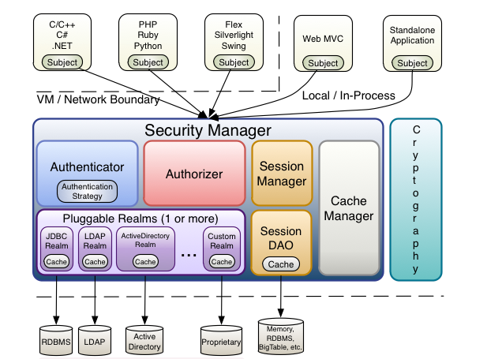
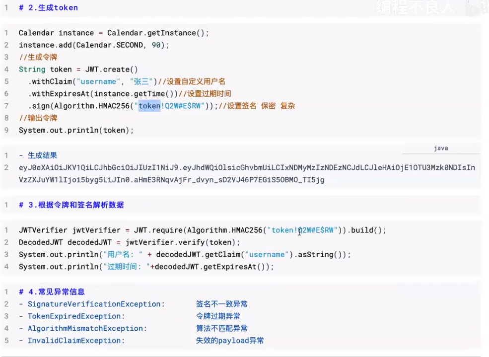

# 安全框架

## 一、手撸权限系统

1. 登陆（认证） authorization

   + 登陆相关内容，如非对称加密、挤人等...
   + 令牌，token、jwt、

2. 权限管理（授权） authentication

   + 把该用户拥有的权限赋予

3. 权限管理的要求：

   + 页面：部分按钮为有权限的人才能访问
   + 后台：部分controller为有权限的人才能访问

   后台权限的设置：

   + 权限设置在Session，同时Session更改一般放在登陆当中。
   + 登陆后需要做的事情：把权限，用户等信息放入session。
   
4. 日志切面事务不融入大事务。

## 二、shiro

1. 框架架构

   

2. 认证

   + Remembered，登陆记住我，说简单点就是再给浏览器一个长期有效的cookie。
   + Authenticated，在敏感操作时，仍需要用户登陆以保证安全。
   + Realm，我简单理解是该框架暴露于我们的一个接口，这个接口可以访问数据库。

3. 授权 

   + Role，角色

   + User，用户

   + Program

     角色：

     ```
     //查看有角色
     Subject currentUser = SecurityUtils.getSubject();
     
     if (currentUser.hasRole("administrator")) {
         //show the admin button 
     } else {
         //don't show the button?  Grey it out? 
     }
     //检验有无角色
     Subject currentUser = SecurityUtils.getSubject();
     
     //guarantee that the current user is a bank teller and 
     //therefore allowed to open the account: 
     currentUser.checkRole("bankTeller");
     openBankAccount();
     ```

     权限：

     ```java
     Permission printPermission = new PrinterPermission("laserjet4400n", "print");
     
     Subject currentUser = SecurityUtils.getSubject();
     
     if (currentUser.isPermitted(printPermission)) {
         //show the Print button 
     } else {
         //don't show the button?  Grey it out?
     }
     
     Subject currentUser = SecurityUtils.getSubject();
     
     //guarantee that the current user is permitted 
     //to open a bank account: 
     Permission p = new AccountPermission("open");
     currentUser.checkPermission(p);
     //上面过不了就抛异常了
     openBankAccount();
     ```

4. Session Management

   + session本身是Tomcat环境中的request和response创建的。Tomcat是在connertor处创建的request和response。要想控制管理session，shiro做法是在进入所有的app之前继承request和response，继承后我们便可以操作session，并对其内存各种进行管理。

5. Realm

   + 同样这个是需要丢给securityManager管理的。

   + Realm是一个接口，暴露给我们我们需要自己实现这个接口，实现接口需要重写两个方法，分别就是从数据库中查找认证信息和权限信息。

6. Cryptography(加密)

   + 加密之前操作是应用盐以及md5进行管理 

7. WEB INI Config

   + urls的配置：

     ```ini
     [urls]
     /index.html = anon
     /user/create = anon
     /user/** = authc
     /admin/** = authc, roles[administrator]
     /rest/** = authc, rest
     /remoting/rpc/** = authc, perms["remote:invoke"]
     ```

     以为我们是为过滤器配置url，这里我们可以理解为为url配置相应的过滤器。以下则是一些默认的过滤器。

     | Filter Name       | Class                                                        |
     | :---------------- | :----------------------------------------------------------- |
     | anon              | [org.apache.shiro.web.filter.authc.AnonymousFilter](http://shiro.apache.org/static/current/apidocs/org/apache/shiro/web/filter/authc/AnonymousFilter.html) |
     | authc             | [org.apache.shiro.web.filter.authc.FormAuthenticationFilter](http://shiro.apache.org/static/current/apidocs/org/apache/shiro/web/filter/authc/FormAuthenticationFilter.html) |
     | authcBasic        | [org.apache.shiro.web.filter.authc.BasicHttpAuthenticationFilter](http://shiro.apache.org/static/current/apidocs/org/apache/shiro/web/filter/authc/BasicHttpAuthenticationFilter.html) |
     | authcBearer       | [org.apache.shiro.web.filter.authc.BearerHttpAuthenticationFilter](http://shiro.apache.org/static/current/apidocs/org/apache/shiro/web/filter/authc/BearerHttpAuthenticationFilter.html) |
     | invalidRequest    | [org.apache.shiro.web.filter.InvalidRequestFilter](http://shiro.apache.org/static/current/apidocs/org/apache/shiro/web/filter/InvalidRequestFilter.html) |
     | logout            | [org.apache.shiro.web.filter.authc.LogoutFilter](http://shiro.apache.org/static/current/apidocs/org/apache/shiro/web/filter/authc/LogoutFilter.html) |
     | noSessionCreation | [org.apache.shiro.web.filter.session.NoSessionCreationFilter](http://shiro.apache.org/static/current/apidocs/org/apache/shiro/web/filter/session/NoSessionCreationFilter.html) |
     | perms             | [org.apache.shiro.web.filter.authz.PermissionsAuthorizationFilter](http://shiro.apache.org/static/current/apidocs/org/apache/shiro/web/filter/authz/PermissionsAuthorizationFilter.html) |
     | port              | [org.apache.shiro.web.filter.authz.PortFilter](http://shiro.apache.org/static/current/apidocs/org/apache/shiro/web/filter/authz/PortFilter.html) |
     | rest              | [org.apache.shiro.web.filter.authz.HttpMethodPermissionFilter](http://shiro.apache.org/static/current/apidocs/org/apache/shiro/web/filter/authz/HttpMethodPermissionFilter.html) |
     | roles             | [org.apache.shiro.web.filter.authz.RolesAuthorizationFilter](http://shiro.apache.org/static/current/apidocs/org/apache/shiro/web/filter/authz/RolesAuthorizationFilter.html) |
     | ssl               | [org.apache.shiro.web.filter.authz.SslFilter](http://shiro.apache.org/static/current/apidocs/org/apache/shiro/web/filter/authz/SslFilter.html) |
     | user              | [org.apache.shiro.web.filter.authc.UserFilter](http://shiro.apache.org/static/current/apidocs/org/apache/shiro/web/filter/authc/UserFilter.html) |

     当然我们是运行自行加入自己的过滤器。

   + 全局过滤器，任何请求都要走过滤器，全局过滤器在main中进行配置。

8. 密码加密

   + 密码比较控制通过credentialsMatcher进行配置，要想实现自己的密码比较，可以实现接口CredentialsMatcher。
   + shiro也提高了大量复杂密码比较器，最常用密码比较器即为Md5CredentialsMatcher，这个密码需要盐，所以我们在自己实现的Realm中要把数据库中的salt加到AuthenticationInfo中(这个有带盐的构造器)
   
9. DelegatingFilterProxy

   + spring提供filter托管，相当于dispatcher

   + 因为在Config中注入了一些filter容器，而不是直接web中进行配置，所以需要先进行filter代理的。

   + 本质上来说DelegatingFilterProxy就是一个Filter，其间接实现了Filter接口，但是**在doFilter中其实调用的从Spring 容器中获取到的代理Filter的实现类delegate。**

     ```xml
     <filter> 
         	<!--这个名字就是我们自己实现的filter的名字，最终是由下面那个代理进行调用-->
             <filter-name>shiroFilterFactoryBean</filter-name>
             <filter-class>org.springframework.web.filter.DelegatingFilterProxy</filter-class>
             <init-param>
                 <param-name>targetFilterLifecycle</param-name>
                 <param-value>true</param-value>
             </init-param>
         </filter>
         <filter-mapping>
             <filter-name>shiroFilterFactoryBean</filter-name>
             <url-pattern>/*</url-pattern>
         </filter-mapping>
     ```

10. 缓存

    + 这一块有待继续学习，因为在权限校验的时候，shiro每次的权限和角色校验都会查数据库，所以一般的操作是把用户的权限和角色都存在缓存里。

## 三、JWT

1. 通俗解释

   + javaWeb中前后端用作安全验证的工具。还能应用于数据传输过程中的数据加密和签名等操作。

2. JWT能做什么

   + 登陆验证，一旦用户登陆后，每个后续请求将包括JWT，从而允许用户访问该令牌的路由。单点登陆是当今广泛使用JWT的一项功能，因为开销小还可以跨域。
   + 信息交换加密验证。

3. session-cookie验证的问题

   + session存于内存，后端开销增大。
   + 分布式微服务情况下，一个session保存于一个服务器上限制了负载均衡的能力。
   + cookie易于被拦截。
   + 前后端分离的系统中，用户的一次请求要转发多次，后端多节点部署情况下session共享存在问题。

4. jwt解决的痛点

   + 服务器不在session中保存用户验证信息，减去服务器负担
   + token是保存在浏览器客户端的。

5. 认证流程：

   + 首先，前端登陆。随后后端验证成功后，生成JWT(token，"token head.payload.singurater")
   + 后端将JWT字符串作为登陆成功结果返回给前端，前端将其保存在localStorage中。
   + 前端每次访问后端时需要将JWT放入HTTP header中的Authorization位中。
   + 再次访问时后端检测JWT是否合法
   + 退出登陆删除token即可。

6. JWT的结构

   + 令牌组成

     1. 标头header.
     2. 有效负载payload.
     3. 签名singnature

   + 具体内容

     1. header(会BASE64进行编码)

        ```json
        {
        	"alg":"HS256",
        	"typ":"JWT"
        }
        ```

        

     2. payload(会BASE64进行编码)，不要添加敏感信息。

        ```json
        {
        	"id":1,
        	"name":"wbw",
        	"permission":"admin"
        }
        ```

     3. signature

        由header和payload的编码结果加上随机盐(秘钥)用加密算法生成。

7. 使用JWT

   + 一般header就用默认的。

   

8. 整合springboot


## 四 shiro+Jwt

1. 认证

2. 授权

   + 授权流程

     

      具体前后端分离的情况：

     1. 前后端分离后，主体subject不再保存在session当中，每次访问后端但凡需要身份授权或登录的请求，就必须要应用subject登录。
     2. 带上token的登录方式，通过自己定义的JwtFilter进行登录，登录后主体就会存在内容。
     3. 身份授权默认的处理方式，一旦主体存在内容，那么就会遍历所有Realm的授权方法。若主体principal为空，hasRole方法直接返回false。

