# 第3阶段 SSM

## 工厂设计模式

+ 简单来说，工厂所实现的就是将对象的创建进行封装。

## 代理设计模式

+ 简单来说，代理对象把被代理对象隔离，满足开闭原则，同时有了代理对象可以不修改被代理对象的基础上进行扩展、增强。目前可以想象成一个web中的filter。
+ 静态代理：手写代理对象。动态代理：代码生成代理对象。各自特点：静态代理，代理对象需要手动实现被代理对象的每种方法的并将其增强。而动态代理，可以利用反射机制，自动生成代理对象，并且该代理对象能够自动增强被代理对象的每个方法。
+ 代理基础有两种方式：1、代理对象与被代理对象实现同一接口(原生JDK)。2、代理对象继承被代理对象(cglib)。

## 手写Mybatis

+ 基础思想，通过一个借口加上一个Mapper的配置文件，自动生成一个代理。

+ 一个dao对应一个mapper，除了mapper.xml还有单独配置mybatis-config.xml，用来将所有mapper加载到内存中。

+ 在内存中的mapper会和dao层进行绑定，生成一个代理对象并执行sql，并拿到返回值。

+ DataSourceFactory生产数据源(通过配置文件拿到一个dataSource(一个数据池))，SessionFactor生产会话(通过dataSource拿到一个connection，用connection初始化session)，Session即一个服务器连接到后端为一次会话。

+ 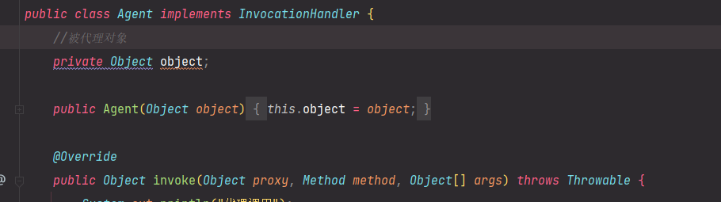

  手写mybatis是没有初始化代理对象的，因为我们的代理对象就是个接口。代理对象就在回调函数中实现了被代理的方法。所以这里不像上面代理设计模式需要传入一个被代理对象，方便在回调函数中调用被代理对象的方法。

## 日志补充

+ slf4j日志门面，log4j是日志实现。

+ log4j 要用配置文件，同时要在mybatis中配置日志。

+ 如何使用日志呢?

  ```java
  //slf4j的工厂
  Logger logger = LoggerFactory.getLogger(this.getClass());
  logger.debug("test");
  ```

  

## Mybatis入门

+ maven工程，编译后classPath在classes里面，所以classloader找文件也是在classes里面找

+ mybatis不主动提交事务，需要手动提交.

+ 配置第三方数据源

  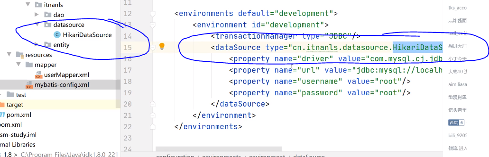

  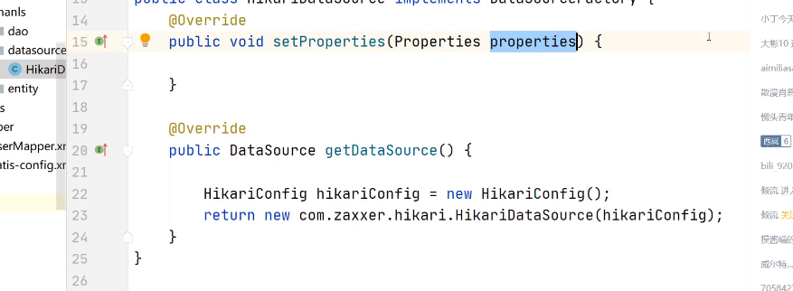
  
+ 别名设置，设置mapper中的类型别名，需要在mybatis-config里面设置

  ```xml
  <typeAliases>
  	<typeAlias type="cn.itnanls.entity.User" alias="user"/>
      <!--或者直接把实体类包引入，进行默认别名设置-->
      <package name="cn.itnanls.entity"/>
  </typeAliases>
  
  <!--或者用注解，前提是需要引入上面的包设置-->
  @Alias("user")
  ```

+ mybatis-config配置文件中的一些标签使用

  1. properties，可以独立数据源配置文件，从而不用更改核心配置文件
  2. settings，可以开启或配置一些东西。重要的是日志配置和缓存设置。
     1. 驼峰设置，可以自动将数据库中带下划线的命名字段转换为java中的驼峰命名与对象的成员对应上。
     2. 日志设置。mybaits有内置日志，可以帮助调试sql语句。

+ resultMap的使用：自定义查表结果与实体类的映射。要用这个东西向要把这个写到Mapper中，并且在sql语句中加这个resultMap  = "userResult"

  ```xml
  <resultMap id="userResult" type="cn.itnanls.entity.User">
  	<!--主键设置 property是实体对象名，column是查表结果字段名-->
      <id property="id" column="id" />
      <!--结果设-->
  	<result property="userName" column="user_name"/>
  </resultMap>
  ```

+ 多表查询是常态。mybatis有提供一定的方法。那么当连表查询的是时候，返回会来对象映射默认映射就可能出问题。 

## Spring

+ 构造器注入有三种方式。1、参数名字，2、参数索引，3、参数类型

+ setter注入相当于空参构造后，用set注入。

+ 自动装配(前提是beans中有了被依赖的bean，这种情况才能自动装配)，autowire="byName"(根据字段名和bean中id命进行对应)或者autowire="byType"(根据字段属性和bean中的属性进行对应)。

+ 注解@Autowire先bytype再byname。注解@Qualifier("address2")以确定名字注入，应该需要配合Autowire，先bytype选出多个类型，在以确定名字自动注入。

+ 应用配置文件中加上<context:component-scan base-package="com.wbw"/>，则会主动扫描对应包下。对应类如果加上@Component注解则会自动将类注入到bean中，就不用在配置文件中手写，但是这样注入类中属性基本都是null。这一般用于service和dao，因为这两对象一般不带参数。即不带默认状态。

+ 方法注入，区别于上一种自动注入的方法。如果bean带有状态就用这种方法。

+ 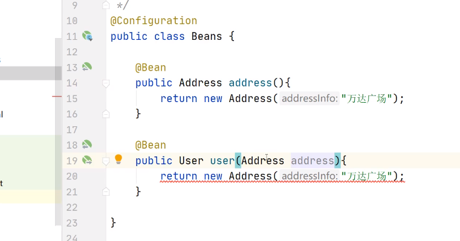

  带上@Configuration注解，会主动扫描其内部带有@Bean的方法，方法返回类型是注入对象类型，方法名就是注入对象id，返回对象就是被注入的对象。

+ entity内的对象一般不需要注入容器，因为这是用来保存数据建立的模型对象。一般有状态的对象注入是写在配置文件中，而无状态的对象注入是通过加@Conponent注解实现

+ spring对controller、service、dao层分别设计了注入层的注解@Controller、@Service、@Re pository

+ **类型转化器**，配置文件中

  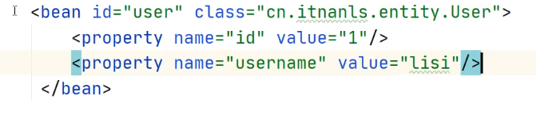

  可以看到配置文件中都是字符串，spring会自动把字符串转为需要的类型。想要实现自己的字符串到对象的转换，需要实现一个继承Convert<S,T>的类并将其注入到容器中，同时

  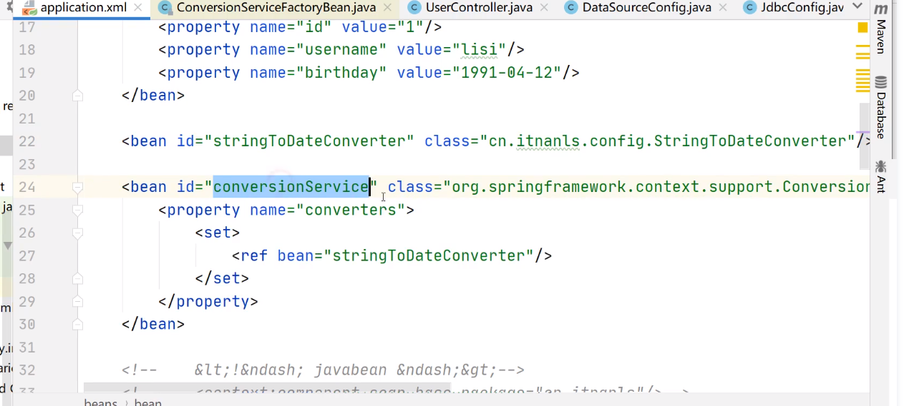

  ### AOP

  + 容器中所有对象都是代理对象。AOP做的就是实现代理。

    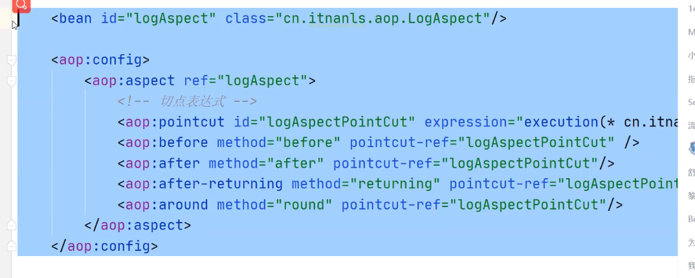

  + 几种通知：

    1. @Before：方法执行前通知
    2. @After： 方法执行后通知
    3. @Around： 环绕通知，会覆盖所有的方法内容
    4. @AfterReturning:： 返回之后进行切入  有异常就不执行了
    5. @AfterThrowing： 异常通知，发生异常会进行通知

  + 切点表达式

    1. "execution(* com.xinzhi.service.impl.*.*(..))"
    2. "@annotation(org.springframework.stereotype.Controller)",注：是去找对应被@Controller注解了的对象
    3. 自己定义方法注解eg:logAnnoation，切点表达式："(@annotation(com.wbw.annotation.logAnnotation)"

  + joinpoint的使用

    1. joinpoint是连接点，可以在写在通知里，获取代理对象和被代理对象，也可以拿到连接点的签名对象。

       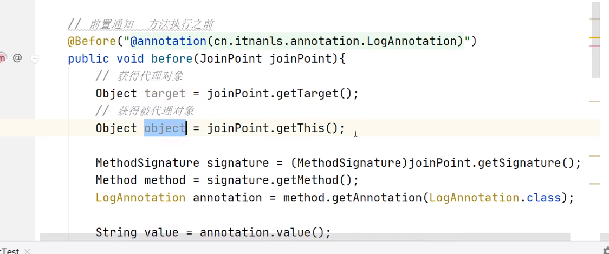

  + 环绕方法的使用

    1. 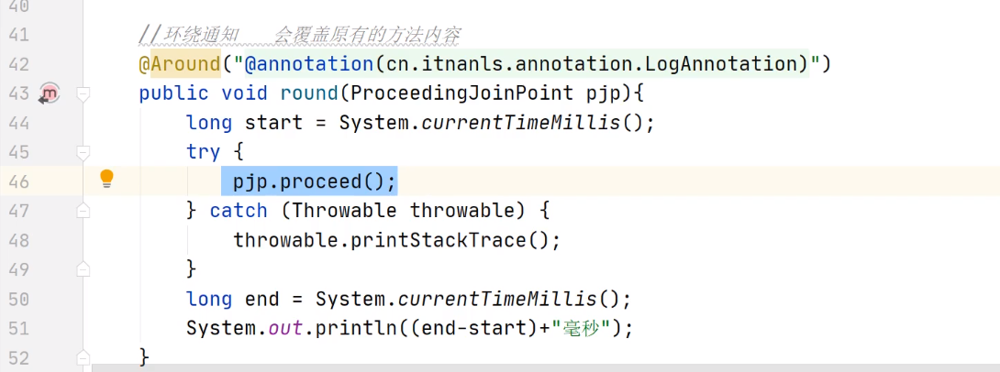


  ## Mybati整合到spring中

  + 最常用：

    1. 注入数据源

    2. 注入SqlSessionFactorBean类，

    3. 扫描Mapper，自动注入代理对象

    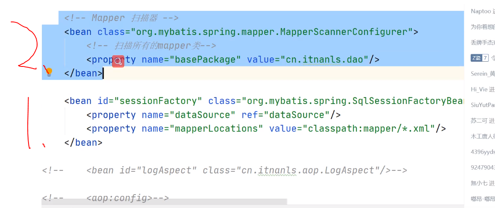

    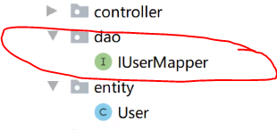

    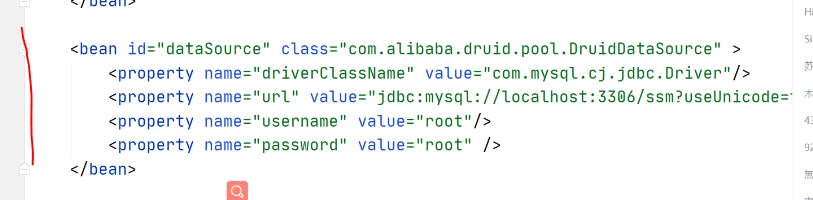

    + 如果不想扫包，接口上加注解:@Mapper
    + 通过@Param注解，对接口传参进行标准，用于告诉mapper中#{}怎么找参数。因为当参数多个后，如#{id}、#{name}两个并不能自动识别参数，只有在接口里面对传入参数加入注解，以便代理对象的生成。


  ## SpringMVC

  + requestMapping函数里的参数，默认会带上注解@RequestParam，作用是会从请求中封装返回一个参数对象。@RequestParam、@RequestBody都是告诉spring我的参数去哪拿
  + 请求转发，在return的字符串里加forward:
  + model可以理解成一个域，这个域是不能请求转发的，只能用在视图转发之间
  + 要想拿JSON数据，要配置app.xml文件，实现对象的转换都是spring配置拦截器的结果。有了转换器不用在注解里面写produce，直接返回对象即可。
  + 转化器的条件是，你写出去的是个对象，转化器会尝试转为JSON。当收到对象content-type是json格式，则会尝试将json字符串转为对象。

  ### 数据转换

  + 前台json对象过来的时候，需要被构建出来的对象可能有日期等复杂变量，此时通过JSON自动转对象就不灵了，需要进行类型转换。
  + 注解DateTimeFormat(patter = "")可以格式化输入日期的字符串为一个Data对象，但是这个注解只支持urlencode格式。
  + 如果需要实现自己的转化器，可以自己实现类继承Convert，在mvc配置中注入自己写的转化器。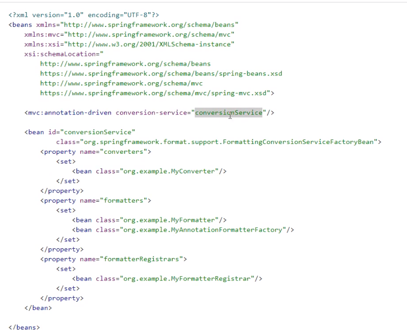

  ### 资源配置

  + 为了一些静态资源不经过dispatchservlet，可以直接访问，需要通过mvc对资源进行配置。

    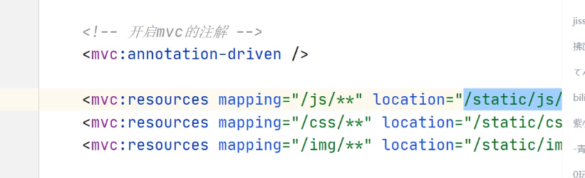


### 拦截器

+ dispatcher之后，Controller之前。与filter的区别是，filter在dispatcher之前。记住，dispatcher自身其实是一个servlet。

+ 自定义拦截器，需实现接口HandlerInterceptor，也需要在配置文件中进行配置。常用于权限拦截

+ 静态资源不进dispatcherServlet，所以静态资源不会被拦截器拦截。

  

  

  

  

  
